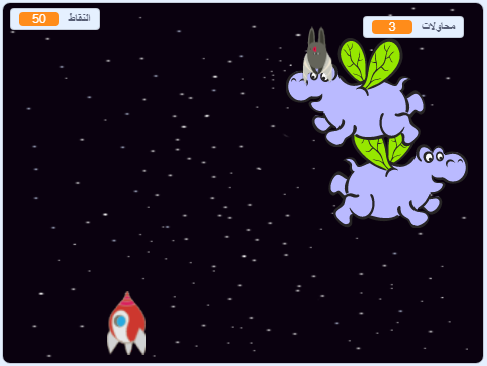

\--- no-print \---

هذا هو إصدار ** Scratch 3 ** من المشروع. هناك أيضًا [ إصدار Scratch 2 للمشروع ](https://projects.raspberrypi.org/en/projects/clone-wars-scratch2).

\--- /no-print \---

## المقدمة

في هذا المشروع، ستتعلم كيف تصنع لعبة تُنقذ فيها كوكب الأرض من وحوش الفضاء.

### ما الذي ستصنعه

\--- no-print \---

Click the green flag in the example game below to start, and then press the <kbd>left</kbd> and <kbd>right</kbd> arrow keys to move the spaceship, and the <kbd>space</kbd> key to shoot.

  <iframe allowtransparency="true" width="485" height="402" src="https://scratch.mit.edu/projects/embed/276887163/?autostart=false" frameborder="0" scrolling="no"></iframe>
  

\--- /no-print \---

Score as many points as you can by shooting flying space-hippos. If you get hit by a hippo or by an orange dropped by the bats, you lose a life.

\--- print-only \---

\--- /print-only \---

\--- collapse \---

* * *

## title: ما ستحتاج إليه

### الأجهزة

+ جهاز كمبيوتر يدعم تشغيل برنامج Scratch 3

### البرامج

+ برنامج Scratch 3 (سواء أكان [عبر الإنترنت](https://rpf.io/scratchon){:target="_blank"} أو [دون اتصال بالإنترنت](https://rpf.io/scratchoff){:target="_blank"})

### Downloads

[Find the downloads here](http://rpf.io/p/en/clone-wars-go).

\--- /collapse \---

\--- collapse \---

* * *

## title: ما الذي ستتعلمه

+ How to make sprites move using keyboard input
+ How to clone sprites to make copies of them
+ How to use 'broadcast' and 'receive blocks' to send messages

\--- /collapse \---

\--- collapse \---

* * *

## title: Additional notes for educators

\--- no-print \---

إذا كنت بحاجة إلى طباعة هذا المشروع ، فالرجاء استخدام الإصدار [الملائم للطابعة](https://projects.raspberrypi.org/en/projects/clone-wars/print){:target="_blank"}.

\--- /no-print \---

You can find the [completed project here](http://rpf.io/p/en/clone-wars-get).

\--- /collapse \---