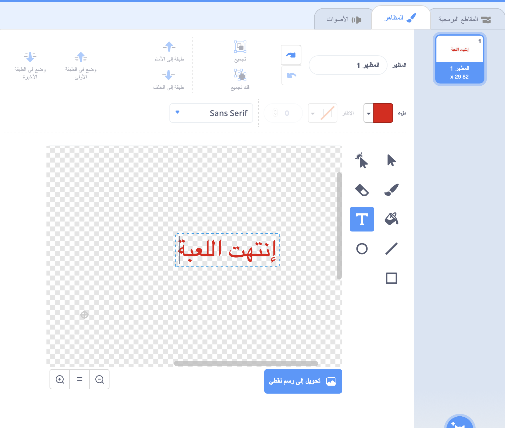

## انتهت اللعبة

بعد ذلك، ستقوم بإضافة رسالة "انتهت اللعبة" في نهاية اللعبة.

\--- task \---

إذا لم تكن قد أنشأتَ متغيرًا جديدًا يُسمى `المحاولات`{:class="blockdata"}، فأنشئه.

يجب أن تبدأ سفينة الفضاء الخاصة بك بثلاثة أرواح (محاولات) وتفقد محاولة كلما لمسها فرس النهر أو البرتقالة. ويجب أن تتوقف لعبتك عندما تنفذ ` المحاولات` {: class = "block3variables"}.

\---/task--

\--- task \---

ارسم كائنًا جديدًا يُسمى `انتهت اللعبة` باستخدام أداة **النصوص**.



\--- /task \---

\--- task \---

على المنصة، بُث رسالة `انتهت اللعبة`{:class="blockevents"} قبل أن تنتهي اللعبة مباشرة.


```blocks3
بث (game over v) وانتظر
```

\--- /task \---

\--- task \---

أضف هذه التعليمة البرمجية إلى كائن `انتهت اللعبة`، بحيث تظهر الرسالة في نهاية اللعبة:


```blocks3
عند نقر ⚑
اختف

عندما تستقبل [game over v]
اظهر
```

لأنك استخدمتَ لبنة `بُث (انتهت اللعبة) وانتظر`{:class="blockevents"} على المنصة، فستنتظر حتى ظهور كائن `انتهت اللعبة` قبل إنهاء اللعبة.

\--- /task \---

\--- task \---

اختبر لعبتك. كم عدد النقاط التي يمكنك إحرازها؟ إذا كانت اللعبة سهلة جدًا أو صعبة جدًا، فهل يمكنك التفكير في طرق لتحسين لعبتك؟

\--- /task \---