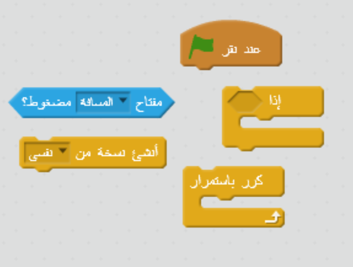
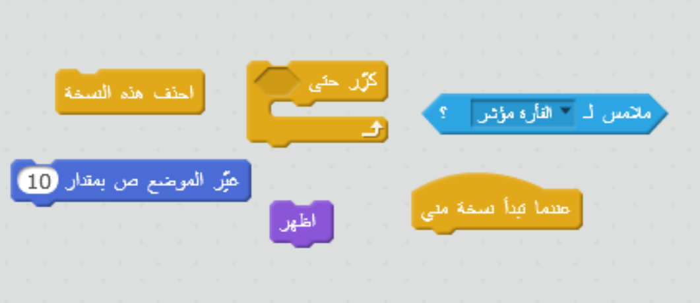

## صواعق برقية

دعونا نعطي سفينة الفضاء القدرة على إطلاق صواعق برقية!

+ أضف كائن `Lightning` من مكتبة Scratch.

+ عندما تبدأ اللعبة، يجب أن يكون الكائن `Lightning` مخفيًا حتى تطلق السفينة الفضائية قذائف الليزر، لذا أضف هذه التعليمة البرمجية إلى كائن `Lightning`:

```blocks
عند نقر ⚑
اختف
```

أصبح لسفينتك الآن إمكانية إطلاق صواعق برقية عملاقة ومتوهجة!

+ أضف بعض التعليمات البرمجية أسفل التعليمة البرمجية التي أضفتها للتو لتصغير كائن `Lightning` و قلبه. عندئذٍ ستبدو السفينة وكأنها تطلق قذائف موزَّعة.

```blocks
اجعل الحجم مساوياً (25) %
اتجه نحو الاتجاه (-90 v)
```

+ انتقل إلى كائن `Spaceship` بالنقر عليه من قائمة الكائنات الموجودة أسفل المنصة.

+ أضف بعض التعليمات البرمجية الجديدة لتجعل كائن `Spaceship` يُطلق صاعقة برقية جديدة في أي وقت يتم فيه الضغط على مفتاح **المسافة**.

\--- hints \--- \--- hint \--- إليك بعض التعليمات البرمجية المستعارة لتستخدمها:

عند النقر على العلم الأخضر تحقق باستمرار إذا تم الضغط على مفتاح **المسافة**، فأنشئ نسخة من كائن `Lightning` \--- /hint \--- \--- hint \--- فيما يلي التعليمات البرمجية التي ستحتاج إليها:

 \--- /hint \--- \--- hint \--- هذه هي التعليمة البرمجية التي ستحتاج إليها:

```blocks
عند نقر ⚑
كرر باستمرار 
  إذا <مفتاح [المسافة v] مضغوط؟> 
    أنشئ نسخة من [Lightning v]
  end
end
```

\--- /hint \--- \--- /hints \---

+ عُد مرة أخرى إلى كائن `Lightning`.

+ متى ما تم إنشاء صاعقة برقية، يجب أن تظهر ثم تتحرك إلى أعلى حتى تصل إلى أعلى الشاشة. ثم يجب أن تختفي.

\--- hints \--- \--- hint \---

عندما تظهر نسخة جديدة من كائن `Lightning`:

+ أظهرها
+ حرِّكها بمقدار `10` إلى أعلى بشكل متكرِّر حتى تلامس حافة الشاشة
+ ثم احذف النسخة \--- /hint \--- \--- hint \--- فيما يلي التعليمات البرمجية التي ستحتاج إليها:

 \--- hint \--- \--- hint \--- هنا التعليمة البرمجية التي ستحتاج إلى إضافتها إلى كائن `Lightning`:

```blocks
    عندما تبدأ نسخة مني
اظهر
كرِّر حتى <touching [edge v] ?> 
  غيِّر الموضع ص بمقدار (10)
end
احذف هذه النسخة
```

\--- /hint \--- \--- /hints \---

+ اختبر كائن `Lightning` بالنقر على العلم الأخضر ثم الضغط على مفتاح **المسافة**. عندما تضغط على مفتاح **المسافة**، هل تظهر صاعقة برقية على الشاشة وتتحرك إلى أعلى؟ ما المشكلة التي يمكن أن تكتشفها؟

## \--- collapse \---

## title: الإجابة

يوجد خطأ — في الوقت الحالي، تُطلق الصواعق البرقية من المكان نفسه دائمًا، بغض النظر عن مكان سفينة الفضاء!

أضف هذه التعليمة البرمجية قبل لبنة `أظهر`{:class="blocklooks"} مباشرة لتجعل نسخة كائن `Lightning` تتحرك إلى موقع كائن `Spaceship` قبل أن تظهر. وبذلك، ستبدو الصاعقة البرقية وكأنها تُطلق من سفينة الفضاء.

```blocks
اذهب إلى [Spaceship v]
```

\--- /collapse \---

+ اضغط على مفتاح **المسافة** لتختبر ما إذا كانت الصواعق البرقية تُطلق الآن من مكانها الصحيح أم لا.

\--- challenge \---

### التحدي: تنظيم ظهور الصواعق البرقية

ماذا يحدث إذا ضغطت مطولًا على مفتاح **المسافة**؟ هل يمكنك أن تستخدم لبنة `انتظر`{:class="blockcontrol"} لتنظيم ذلك؟

\--- /challenge \---