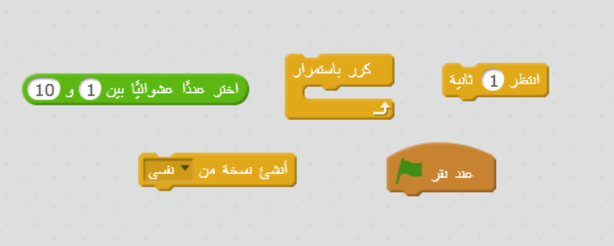

## أفراس النهر الفضائية الطائرة

لنُضف الكثير من الأفراس الطائرة التي ستحاول تدمير سفينتك الفضائية.

+ أنشئ كائنًا جديدًا باستخدام صورة `Hippo1` الموجودة في مكتبة Scratch. استخدم الأداة **تقليص** لتجعل حجم الكائن `Hippo` مقاربًا لحجم الكائن `Spaceship`.


+ عيِّن أسلوب الدوران للكائن `Hippo` إلى اليمين وإلى اليسار فقط.

[[[generic-scratch-sprite-rotation-style]]]

+ أضف بعض التعليمات البرمجية لإخفاء الكائن `Hippo` عندما تبدأ اللعبة.

\--- hints \--- \--- hint \--- ستكون التعليمة البرمجية هي نفسها التعليمة البرمجية التي استخدمتها لإخفاء الكائن `Lightning` عندما تبدأ اللعبة. \--- /hint \--- \--- hint \--- هذه هي التعليمة البرمجية التي ستحتاج إليها:

```blocks
عند نقر ⚑
اختف
```

\--- /hint \--- \--- /hints \---

+ انتقل إلى المنصة بالنقر عليها في القائمة السفلية.

+ أضف بعض التعليمات البرمجية إلى المنصة لإنشاء فرس جديد كل بضع ثوان.

\--- hints \--- \--- hint \--- عند النقر على العلم الأخضر: بشكل متكرر...

+ انتظر من ثانيتين إلى 4 ثوانِ
+ أنشئ نسخة من كائن الفرس

\--- /hint \--- \--- hint \--- فيما يلي التعليمات البرمجية التي ستحتاج إليها: 

\--- /hint \--- \--- hint \--- هذه هي التعليمة البرمجية التي ستحتاج إليها:

```blocks
عند نقر ⚑
كرر باستمرار 
  انتظر (اختر عدداً عشوائياً بين (2) و (4)) ثانية
  أنشئ نسخة من [Hippo1 v]
end
```

\--- /hint \--- \--- /hints \---

+ عُد مرة أخرى إلى كائن `Hippo`.

يجب أن يظهر كل فرس جديد عند موقع x عشوائي، ويجب أن يكون لكل فرس سرعة عشوائية.

+ أنشئ متغيرًا جديدًا يُسمى `السرعة`{:class="blockdata"} بحيث يكون هذا المتغير للكائن `Hippo` فقط.

[[[generic-scratch-add-variable]]]

ستعلم أنك قمتَ بذلك على الوجه الصحيح عندما ترى اسم الكائن بجوار المتغير، كما هو موضح أدناه:


+ عندما تبدأ كل نسخة من كائن الفرس، اختر سرعة وموقع بدء عشوائيَين قبل إظهارها على الشاشة.

```blocks
عندما تبدأ نسخة مني
اجعل [speed v] مساوياً (اختر عدداً عشوائياً بين (2) و (4))
اذهب إلى الموضع س: (اختر عدداً عشوائياً بين (-220) و (220)) ص: (150)
اظهر
```

+ اختبر التعليمة البرمجية بالنقر على العلم الأخضر. هل يظهر فرس جديد كل بضع ثوان؟ في هذه اللحظة لن تتحرك أفراس النهر.

+ يجب أن يتحرك الفرس هنا وهناك بشكل عشوائي إلى أن تصيبه صاعقة برقية. لتجعل ذلك يحدث، أدخل هذه التعليمة البرمجية أسفل التعليمات البرمجية التي أضفتها للتو:

```blocks
كرِّر حتى <ملامس لـ [lightning v] ؟> 
  تحرك (speed) خطوة
  استدر ↻ (اختر عدداً عشوائياً بين (-10) و (10)) درجة
  ارتد إذا كنت عند الحافة
end
احذف هذه النسخة
```

+ اختبر التعليمة البرمجية للفرس. يجب أن ترى نسخة جديدة للفرس تظهر كل بضع ثوان، و كل نسخة يجب أن تتحرك بسرعة عشوائية.
    
    

+ اختبر قذيفة الليزر. إذا أصبتَ فرسًا، هل يختفي؟