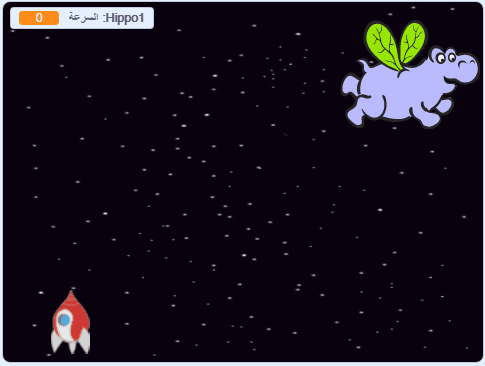

## أفراس نهر الفضاء

الآن ستقوم بإضافة الكثير من أفراس النهر الطائرة التي تحاول تدمير سفينتك الفضائية.

\--- task \---

قم بإنشاء كائن جديد باستخدام صورة "Hippo1" من مكتبة السكراتش. استخدم أداة **تقليص** لجعل كائن `فرس النهر` بحجم مماثل لـ `سفينة الفضاء`.


\---/task--

\--- task \---

عيِّن أسلوب الدوران للكائن `Hippo` إلى **يمين- يسار **فقط.

[[[generic-scratch3-sprite-rotation-style]]]

\--- /task \---

\--- task \---

أضف بعض التعليمات البرمجية لإخفاء الكائن `Hippo` عندما تبدأ اللعبة.


```blocks3
عند نقر ⚑
اختف
```

\--- /task \---

\--- task \---

أضف بعض التعليمات البرمجية إلى المنصة لإنشاء `فرس نهر` جديد كل بضع ثوان.

\--- hints \---

\--- hint \---

عند `النقر فوق العلم الأخضر` `بإستمرار`، `إنتظر` `بين ٢ و ٤ ثواني` ومن ثم `أنشئ نسخة من كائن فرس النهر`.

\--- hint/ \---

\--- hint \---

إليك الكتل التي تحتاجها:

```blocks3
كرِّر باستمرار
end

أنشئ نسخة من (Hippo1 v)

(عدد عشوائي بين (2) و (4))

عند نقر ⚑

انتظر () ثانية
```

\--- hint/ \---

\--- hint \---

و هذا ما يجب أن تبدو عليه التعليمات البرمجية الخاصة بك:


```blocks3
عند نقر ⚑
كرِّر باستمرار 
  انتظر (عدد عشوائي بين (2) و (4)) ثانية
  أنشئ نسخة من (Hippo1 v)
end
```

\--- hint/ \---

\--- hints/ \---

\--- /task \---

يجب أن يظهر كل فرس جديد عند موقع `س` عشوائي، ويجب أن يكون لكل فرس سرعة عشوائية.

\--- task \---

أنشئ متغيرًا جديدًا يُسمى `السرعة` بحيث يكون هذا المتغير للكائن `Hippo` فقط.

[[[generic-scratch3-add-variable]]]

ستعلم أنك قمتَ بذلك على الوجه الصحيح عندما ترى اسم الكائن بجوار المتغير، كما هو موضح أدناه:


\--- /task \---

\--- task \---

عندما تبدأ كل نسخة من كائن `الفرس`، اختر سرعة وموقع بدء عشوائيَين. ثم أظهرها على الشاشة.

```blocks3
عندما تبدأ نسخة مني
اجعل [speed v] مساوياً (اختر عدداً عشوائياً بين (2) و (4))
اذهب إلى الموضع س: (اختر عدداً عشوائياً بين (-220) و (220)) ص: (150)
اظهر
```

\--- /task \---

\--- task \---

اختبر التعليمات البرمجية الخاصة بك. هل يظهر فرس النهر الجديد كل بضع ثوان؟

\--- /task \---

في هذه اللحظة لا يتحرك أفراس النهر.

\--- task \---

يجب أن يتحرك كل فرس النهر بشكل عشوائي حتى تصطدم به صاعقة البرق. لتحقيق ذلك، قم بإرفاق هذه التعليمات البرمجية أسفل الكتل الموجودة بالفعل في النص البرمجي للكائن `Hippo`:

```blocks3
كرِّر حتى <touching (lightning v) ?> 
  تحرك (speed :: variables) خطوة
  استدر ↻ (عدد عشوائي بين (-10) و (10)) درجة
  ارتد إذا كنت عند الحافة
end
احذف هذه النسخة
```

\--- /task \---

\--- task \---

اختبر تعليماتك البرمجية مرة أخرى. يجب أن ترى نسخة فرس النهر جديدة تظهر كل بضع ثوان، ويجب أن تتحرك كل نسخة بسرعة مختلفة.

\--- no-print \---



\--- /no-print \---

\--- /task \---

\--- task \---

الآن اختبر مدفع الليزر في سفينة الفضاء. إذا صدمت صاعقة فرس النهر، فهل يتلاشى فرس النهر؟

\--- /task \---