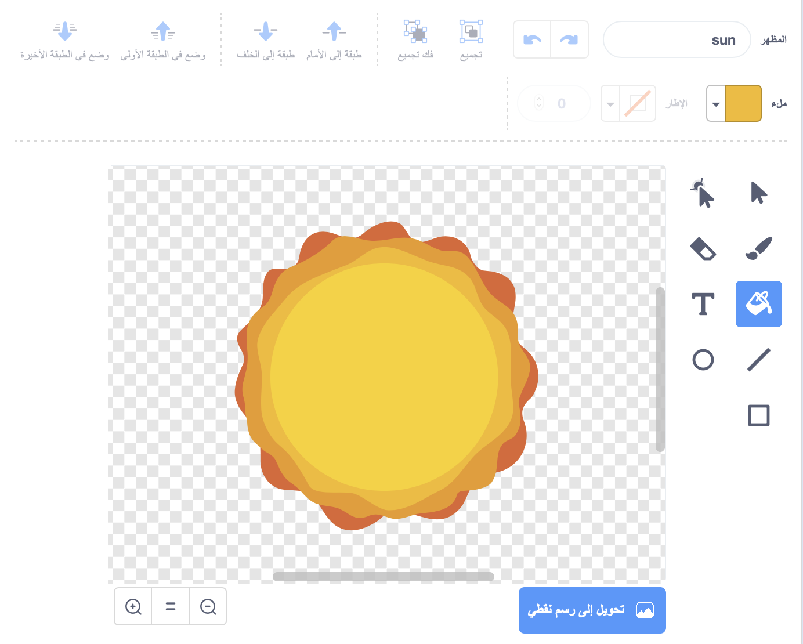

## انفجار سفينة الفضاء

عندما يلمس فرس النهر سفينة الفضاء، يجب أن تنفجر السفينة!

\--- task \---

حدِّد كائن `Spaceship` وأعد تسمية مظهره إلى 'عادي'.

\---/task--

\--- task \---

ارسم زيًا آخر لسفينة فضائية تنفجر، واستدعِ الزي الجديد "ضرب".


أو إذا كنت لا تريد أن ترسم مظهر الانفجار، يمكنك أن تختار زي 'Sun' من مكتبة سكراتش، وتستخدم أداة **تلوين الشكل** لتغيير لونه.



\---/task\---

\--- task \---

Add some code to your `Spaceship` sprite so that it displays the 'normal' costume when the game starts, and switches to the 'hit' costume when it touches a hippo:


```blocks3
when flag clicked
switch costume to (normal v)
wait until <touching (Hippo1 v)>?
switch costume to (hit v)
```

\--- /task \---

\--- task \---

Test your code. Make the spaceship collide with a hippo. Does the spaceship change to the 'hit' costume?

\--- /task \---