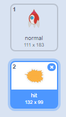

## انفجار سفينة الفضاء

عندما يلمس فرس النهر سفينة الفضاء، يجب أن تنفجر السفينة!

\--- task \---

حدِّد كائن `Spaceship` وأعد تسمية مظهره إلى 'عادي'.

\---/task--

\--- task \---

ارسم زيًا آخر لسفينة فضائية تنفجر، وسمِّ الزي الجديد "اصطدام".



أو إذا كنت لا تريد أن ترسم مظهر الانفجار، يمكنك أن تختار زي 'Sun' من مكتبة سكراتش، وتستخدم أداة **تلوين الشكل** لتغيير لونه.


\---/task\---

\--- task \---

أضف بعض التعليمات البرمجية إلى كائن `Spaceship` بحيث تعرض الزي "عادي" عند بدء اللعبة، وتتحول إلى زي "اصطدام" عندما تلامس فرس النهر:


```blocks3
عند نقر ⚑
غيِّر المظهر إلى (normal v)
انتظر حتى <touching (Hippo1 v)>
غيِّر المظهر إلى (hit v)
```

\--- /task \---

\--- task \---

اختبر التعليمة البرمجية. اجعل سفينة الفضاء تصطدم بفرس النهر. هل تتغير سفينة الفضاء إلى مظهر 'اصطدام'؟

\--- /task \---