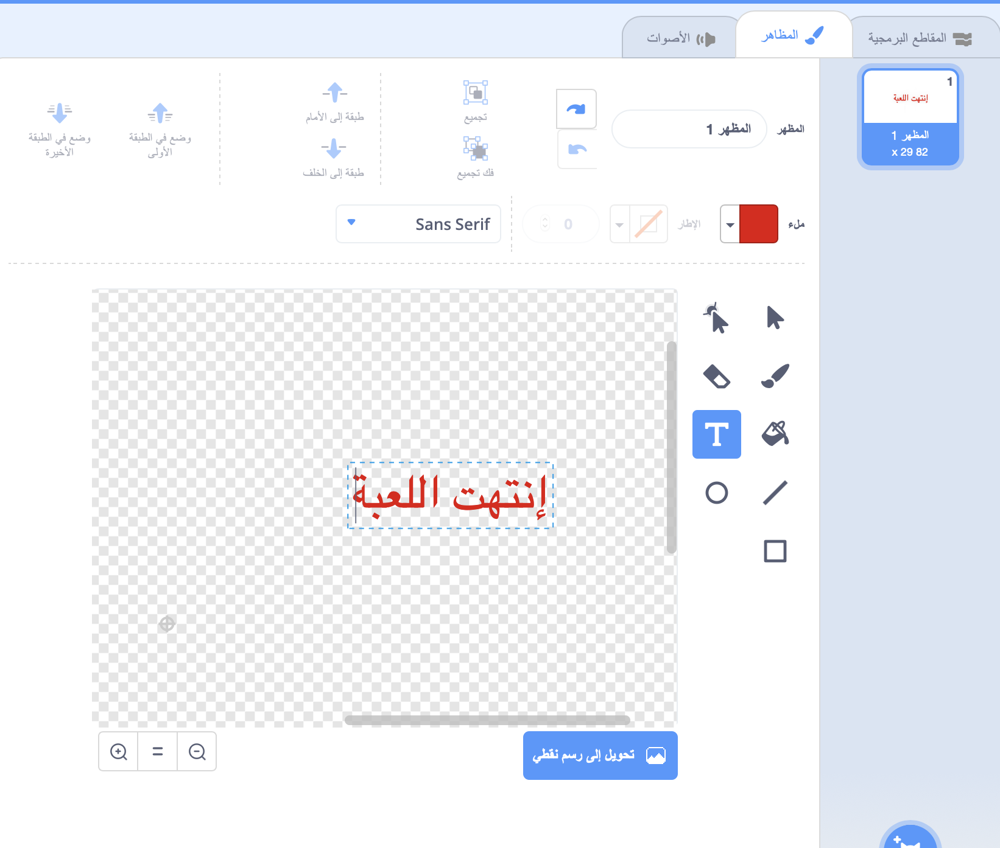

## انتهت اللعبة

لنُضِف رسالة 'انتهت اللعبة' في نهاية اللعبة.

+ إذا لم تكن قد أنشأتَ متغيرًا جديدًا يُسمى `المحاولات`{:class="blockdata"}، فأنشئه.

يجب أن تبدأ سفينة الفضاء بثلاث محاولات وتخسر محاولة عندما تلامس فرسًا أو برتقالة. كما يجب أن تتوقف لعبتك عندما تنفد المحاولات. إذا كنت تحتاج إلى مساعدة، فيمكنك استخدام مشروع [جمع النقاط](https://codeclubprojects.org/en-GB/scratch/catch-the-dots/) لمساعدتك.

+ ارسم كائنًا جديدًا يُسمى `انتهت اللعبة` باستخدام أداة **النصوص**.



+ على المنصة، بُث رسالة `انتهت اللعبة`{:class="blockevents"} قبل أن تنتهي اللعبة مباشرة.

```blocks
بث [game over v] وانتظر
```

+ أضف هذه التعليمة البرمجية إلى كائن `انتهت اللعبة`، بحيث تظهر الرسالة في نهاية اللعبة:

```blocks
عند نقر ⚑
اختف

عندما تستقبل [game over v]
اظهر
```

لأنك استخدمتَ لبنة `بُث [انتهت اللعبة] وانتظر`{:class="blockevents"} على المنصة، فستنتظر المنصة حتى ظهور كائن `انتهت اللعبة` قبل إنهاء اللعبة.

+ اختبر لعبتك. كم عدد النقاط التي يمكنك إحرازها؟ إذا كانت اللعبة سهلة جدًا أو صعبة جدًا، فهل يمكنك التفكير في طرق لتحسين لعبتك؟