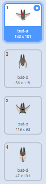

## انتهت اللعبة

لزيادة مستوى صعوبة اللعبة، لننشئ خفاش يرمي برتقالًا على سفينة الفضاء.


\--- task \---

أضف كائن `Bat` وعيِّن أسلوب دورانه إلى **يسار-يمين** فقط.

\---/task--

\--- task \---

اجعل الكائن `Bat` `يتحرك`{:class="blockmotion"} من جانب إلى آخر أعلى المنصة ضمن حلقة `كرِّر باستمرار`{:class="blockcontrol"}.


```blocks3
عند نقر ⚑
اجعل الحجم مساويًا (50) ٪
كرِّر باستمرار 
  تحرك (10) خطوة
  ارتد إذا كنت عند الحافة
end
```

تذكر أن تختبر تعليماتك البرمجية.

\---/task\---

إذا نظرتَ إلى مظاهر الخفاش، فستجد انه لديه أربع مظاهر مختلفة:



\--- task \---

استخدم لبنة `المظهر التالي`{:class="blocklooks"} لتجعل الخفاش يضرب بجناحيه أثناء تحركه.

\--- hints \---

\--- hint \---

بعد أن يتحرك الخفاش، يجب أن يظهر `المظهر التالي`{:class="blocklooks"} ثم `ينتظر`{:class="blockcontrol"} لفترة قصيرة.

\--- hint/ \---

\--- hint \---

تحتاج إلى إضافة هذه الكتل للكود الخاصة بك:

```blocks3
انتظر (0.3) ثانية

المظهر التالي
```

\--- hint/ \---

\--- hint \--- يجب أن تبدو التعليمة البرمجية خاصتك بالشكل التالي:

```blocks3
عند نقر ⚑
اجعل الحجم مساويًا (50) ٪
كرِّر باستمرار 
 تحرك (10) خطوة
 ارتد إذا كنت عند الحافة

 + المظهر التالي
 + انتظر (0.3) ثانية
end
```

\--- hint/ \---

\--- hints/ \---

\--- /task \---

والآن، لنجعل الخفاش يرمي البرتقال!

\--- task \---

أضف كائن `Orange` جديدًا من مكتبة سكراتش.


\--- /task \---

\--- task \---

أضف رمزًا إلى خفاشك بحيث ` عند النقر على العلم ` {: class = "block3events"}، فإن كائن `الخفاش` ` إلى الأبد ` {: class = "block3control"} ` ينتظر ` {: class = "block3control"} فترة زمنية عشوائية ` ` {: class = "block3operators"}، بين ` ٥ إلى ١٠ ` {: class = "block3operators"} ثانية، ثم ` ينشيء نسخة ` {: class = "block3control"} من كائن ` البرتقالة `.


```blocks3
عند نقر ⚑
كرِّر باستمرار 
  انتظر (عدد عشوائي بين (5) و (10)) ثانية
  أنشئ نسخة من (Orange v)
end
```

\--- /task \---

\--- task \---

أضف التعليمات البرمجية إلى كائن ` البرتقالة ` لجعل كل من نسخة تسقط ، بدءا من كائن ` الخفاش ` نحو أسفل المنصة.


```blocks3
    عند نقر ⚑
اختفِ

عندما تبدأ نسخة مني
اذهب إلى (Bat v)
اظهر
كرِّر حتى< ملامس لـ (edge v)
  غيِّر الموضع ص بمقدار (-4)
end
احذف هذه النسخة
```

\--- /task \---

\--- task \---

أضف بعض التعليمات البرمجية الأخرى إلى كائن البرتقالة `Orange` بحيث عندما تصطدم `برتقالة` بكائن سفينة الفضاء `Spaceship`، يختفي النسخة هي الآخرى لتعطي اللاعب فرصة لاستعادة قوته:


```blocks3
    عندما تستقبل [hit v]
احذف هذه النسخة
```

\--- /task \---

\--- task \---

ستحتاج أيضًا إلى تعديل التعليمة البرمجية في الكائن `Spaceship` بحيث يصطدم عندما يلامس كائن `Hippo` أو كائن `Orange`:


```blocks3
    انتظر حتى <<touching (Hippo1 v)?> أو<touching (Orange v)?>>
```

\--- /task \---

\--- task \---

Test your game. What happens if the spaceship gets hit by a falling orange?

\--- /task \---