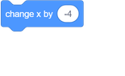
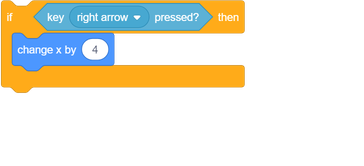

## Make a spaceship

First make a spaceship that can defend the Earth!

\--- কাজ \---

Open the 'Clone wars' Scratch starter project.

**Online:** open the starter project at [rpf.io/clone-wars-on](http://rpf.io/clone-wars-on){:target="_blank"}.

**Offline:** download the starter project from [rpf.io/p/en/clone-wars-go](http://rpf.io/p/en/clone-wars-go), and then open it using the offline editor.

If you need to download and install the Scratch offline editor, you can find it at [rpf.io/scratchoff](https://rpf.io/scratchoff){:target="_blank"}.

\--- /কাজ \---

\--- কাজ \---

Add this code to the spaceship sprite to make the spaceship move left if the <kbd>left</kbd> arrow is pressed:

The x-axis goes from the left side of the Stage to the right side. This means that the spaceship moves to the left when you subtract from the value of the spaceship sprite's `x` position. So this code block is the part that makes your spaceship move left:

\--- /কাজ \---

\--- কাজ \---

Add some more code inside the `forever`{:class="block3control"} block to make your spaceship move to the right if the <kbd>right</kbd> arrow key is pressed.

\--- hints \---

\--- hint \---

Subtracting `4` from the spaceship's `x` position made it move left, so how could you make the spaceship move right by `4` instead?

\--- /hint \---

\--- hint \---

You need the same code block, but with a different number:

\--- /hint \---

\--- hint \---

Here is the code you need to add below the other code inside the `forever`{:class="block3control"} block:

 \--- /hint \---

\--- /hints \---

\--- /কাজ \---

\--- কাজ \---

Test your project by clicking the green flag. Can you press the arrow keys to make your spaceship move left and right?

\--- /কাজ \---