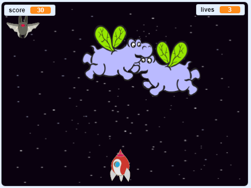

--- no-print ---

এটি প্রকল্পের **Scratch 3** সংস্করণ। এছাড়াও প্রকল্পের [Scratch 2 সংস্করণ ](https://projects.raspberrypi.org/bn-IN/projects/clone-wars-scratch2) রয়েছে।.

--- /no-print ---

## ভূমিকা

এই প্রকল্পে আপনি শিখবেন কীভাবে এমন একটি গেম তৈরি করা যায় যা দিয়ে আপনি মহাকাশ দানব এর থেকে পৃথিবীকে বাঁচাতে পারবেন ।.

### আপনি যা বানাবেন

--- no-print ---

শুরু করতে নীচের উদাহরণের সবুজ পতাকাটি ক্লিক করুন এবং তারপরে মহাকাশযান টি সরানোর জন্য <kbd>left</kbd> এবং <kbd>right</kbd> তীর কীগুলি চাপুন এবং <kbd>space</kbd> চাপুন গুলি করতে।.

  <iframe allowtransparency="true" width="485" height="402" src="https://scratch.mit.edu/projects/embed/276887163/?autostart=false" frameborder="0" scrolling="no"></iframe>
  

--- /no-print ---

উড়ন্ত স্পেস-হিপ্পো শুটিং করে আপনি যতগুলি পয়েন্ট পাবেন তা স্কোর করুন। আপনি যদি হিপ্পো বা বাদুড় দ্বারা ফেলে আসা কমলালেবু দ্বারা আঘাত পান তবে আপনি একটি জীবন হারাবেন।.

--- print-only ---

--- /print-only ---

--- collapse ---
---
title: যা আপনার প্রয়োজন হবে
---

### Hardware

+ Scratch 3 চালানোর জন্য সক্ষম একটি কম্পিউটার

### Software

+ Scratch 3 (either [online](https://rpf.io/scratchon){:target="_blank"} or [offline](https://rpf.io/scratchoff){:target="_blank"})

### Downloads

[Find the downloads here](https://rpf.io/p/bn-IN/clone-wars-go) ডাউনলোডগুলি এখানে সন্ধান করুন.

--- /collapse ---

--- collapse ---
---
title: যা আপনি শিখবেন
---

+ কী-বোর্ড ইনপুট ব্যবহার করে কিভাবে sprite গুলিকে সরানো যায়
+ ক্লোন sprite গুলির অনুলিপি তৈরি করতে কী করবেন
+ বার্তা প্রেরণের জন্য কীভাবে 'সম্প্রচার' এবং 'ব্লকগুলি গ্রহণ' করবেন

--- /collapse ---

--- collapse ---
---
title: শিক্ষাবিদদের জন্য অতিরিক্ত নোট
---

--- no-print ---

আপনার যদি এই প্রকল্পটি মুদ্রণের প্রয়োজন হয় তবে [printer-friendly version](https://projects.raspberrypi.org/bn-IN/projects/clone-wars/print){:target="_blank"} ব্যবহার করুন.

--- /no-print ---

[completed project here](https://rpf.io/p/bn-IN/clone-wars-get) এখানে সমাপ্ত প্রকল্পটি খুঁজে পেতে পারেন.

--- /collapse ---
