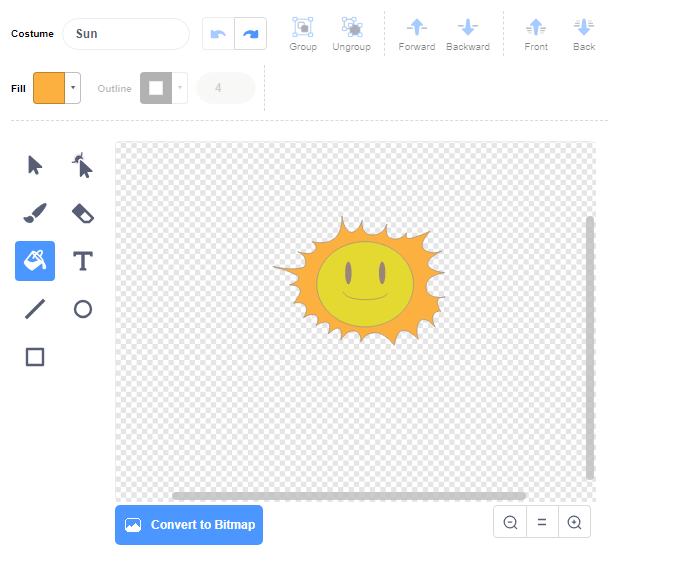

## মহাকাশযান বিস্ফোরণ

যখন একটি জলহস্তী বা hippo আপনার মহাকাশযান স্পর্শ করে, তখন মহাকাশযানটি বিস্ফোরিত হওয়া উচিত!

--- task ---

`spaceship` sprite টি নির্বাচন করুন এবং এর costume এর নামকরণ করুন 'normal'।.

--- /task ---

--- task ---

বিস্ফোরিত মহাকাশযানের একটি costume আঁকুন এবং নতুন costume কে 'hit' নাম দিন।.


আপনি যদি বিস্ফোরণ আঁকতে না চান তবে আপনি Scratch library থেকে 'sun' costume টি নিতে পারেন এবং তারপরে costume এর রঙ এবং চেহারা পরিবর্তন করতে **Color a shape** tool টি ব্যবহার করতে পারেন।.



--- /task ---

--- task ---

আপনার `Spaceship` sprite এ কিছু কোড যুক্ত করুন যাতে এটি খেলা শুরু হওয়ার পরে 'normal' costume প্রদর্শন করে এবং জলহস্তী বা hippo স্পর্শ করলে 'hit' পোশাকটিতে পরিবর্তিত হয়:


```blocks3
when flag clicked
switch costume to (normal v)
wait until <touching (Hippo1 v)>?
switch costume to (hit v)
```

--- /task ---

--- task ---

আপনার কোড পরীক্ষা করুন। একটি জলহস্তী বা hippo দিয়ে মহাকাশযানের সাথে সংঘর্ষ করান। মহাকাশযানের পোশাক কি 'hit' এ পরিবর্তিত হয়?

--- /task ---