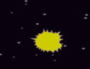

## অদৃশ্য জলহস্তী বা hippo

যখন মহাকাশযানটি বিস্ফোরিত হয়, সমস্ত জলহস্তী বা hippo গুলি অদৃশ্য হয়ে যায় যাতে গেমের খেলোয়াড়রা পুনরুদ্ধার করতে পারে।.

\--- task \---

মহাকাশযান sprite এ কোড যুক্ত করুন 'hit' বার্তা `broadcast`{:class="block3events"} করতে যখন `spaceship touches a hippo`{:class="block3sensing"}.


```blocks3
when flag clicked
switch costume to (normal v)
wait until <touching (Hippo1 v)>?
switch costume to (hit v)

+ broadcast (hit v)
```

\--- /task \---

\--- task \---

সমস্ত `Hippo` sprite ক্লোনগুলি "hit" বার্তাটি গ্রহণ করবে এবং `hippo` sprite এ এই কোডটি যুক্ত করে আঘাত হানার পরে আপনি তাদের অদৃশ্য হওয়ার নির্দেশ দিতে পারেন:


```blocks3
when I receive [hit v]
delete this clone
```

\--- /task \---

\--- task \---

নতুন কোড কাজ করে কিনা তা যাচাই করতে, সবুজ পতাকাটি ক্লিক করুন এবং মহাকাশযানটিকে জলহস্তীর সাথে সংঘর্ষ ঘটান।.



\--- /task \---

মহাকাশযান বিস্ফোরণের পরে নতুন `hippo` ক্লোন উপস্থিত হয় তবে তখনও মহাকাশযানটি বিস্ফোরিত অবস্থায় থাকবে! আঘাতের পরে মহাকাশযানটিকে নিজেকে পুনরায় সেট করবে।.

\--- task \---

`Spaceship` sprite এর কোড শেষে একটি `wait`{:class="block3control"} ব্লক যুক্ত করুন যাতে জলহস্তী/hippo আবার প্রদর্শিত হওয়ার আগে একটি ছোট বিরতি তৈরি করে।. তারপর কোড বারবার চালাতে একটি `forever`{:class="block3control"} ব্লক যোগ করুন আপনার কোডের চারদিকে।.


```blocks3
when flag clicked
forever
switch costume to (normal v)
wait until <touching (Hippo1 v)>?
switch costume to (hit v)
broadcast (hit v)

+ wait (1) seconds
end
```

\--- /task \---