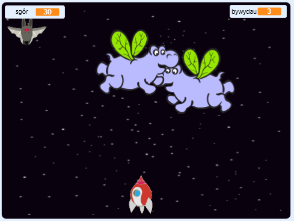

\--- no-print \---

Dyma fersiwn **Scratch 3** y prosiect. Ceir hefyd [fersiwn Scratch 2 o'r prosiect](https://projects.raspberrypi.org/en/projects/clone-wars-scratch2).

\--- /no-print \---

## Cyflwyniad

Yn y prosiect hwn byddi di'n dysgu sut i greu gêm lle mae'n rhaid achub y Ddaear rhag bwystfilod gofod.

### Yr hyn byddi di'n ei greu

\--- no-print \---

Clicia'r faner werdd yn esiampl y gêm isod i gychwyn, yna gwasga ar y bysellau saeth <kbd>chwith</kbd> a <kbd>dde</kbd> i symud y llong ofod, a'r bysell <kbd>bwlch</kbd> i saethu.

  <iframe allowtransparency="true" width="485" height="402" src="https://scratch.mit.edu/projects/embed/276887163/?autostart=false" frameborder="0" scrolling="no"></iframe>
  

\--- /no-print \---

Sgoria cymaint o bwyntiau ag sy'n bosib wrth saethu hippos-gofod sy'n hedfan. Os wyt ti'n cael dy daro gan hippo neu gan oren sy'n cael ei ollwng gan ystlum, rwyt ti'n colli bywyd.

\--- print-only \---

\--- /print-only \---

\---collapse\---

* * *

## title: Beth fydd ei angen arno ti

### Caledwedd

+ Cyfrifiadur sy'n gallu rhedeg Scratch 3

### Meddalwedd

+ Scratch 3 (unai [arlein](https://rpf.io/scratchon){:target="_blank"} neu [all-lein](https://rpf.io/scratchoff){:target="_blank"})

### Lawrlwythiadau

[Ffeiliau i'w lawrlwytho yma](http://rpf.io/p/en/clone-wars-go).

\--- /collapse \---

\---collapse\---

* * *

## title: Yr hyn byddi di'n ei ddysgu

+ Sut i wneud i gorluniau symud gan ddefnyddio'r bysellfwrdd
+ Sut i glonio corluniau i wneud copïau ohonynt
+ Sut i ddefnyddio 'darlledu' a 'derbyn blociau' i anfon negeseuon

\--- /collapse \---

\---collapse\---

* * *

## title: Gwybodaeth ychwanegol i addysgwyr

\--- no-print \---

Os oes angen i chi argraffu y prosiect, defnyddiwch [fersiwn i'w argraffu](https://projects.raspberrypi.org/en/projects/clone-wars/print){:target="_blank"}.

\--- /no-print \---

Gallwch ddod o hyd i'r prosiect gorffenedig [ yma ](http://rpf.io/p/en/clone-wars-get).

\--- /collapse \---