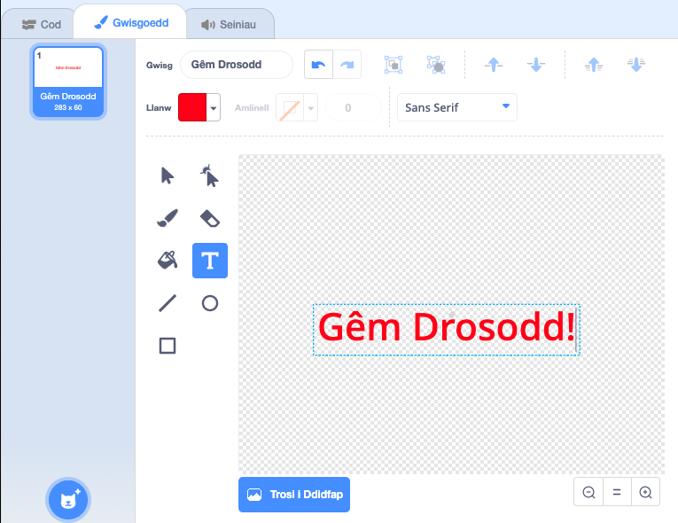

## Gêm drosodd

Fe awn ati i ychwanegu neges ‘Gêm drosodd’ i ddiwedd y gêm.

\--- task \---

Os nad wyt ti wedi gwneud yn barod, bydd angen creu newidyn newydd o’r enw `bywydau`{:class="block3variables"}.

Fe ddylai dy long ofod ddechrau gyda 3 bywyd a colli bywyd pryd bynnag mae’r gelyn yn ei gyffwrdd. Fe ddylai dy gêm hefyd ddod i ben pan nad oes `bywydau`{:class="block3variables"} ar ôl.

\--- /task \---

\--- task \---

Llunia ciplun newydd o’r enw `Gêm Drosodd`, gan ddefnyddio’r teclyn **testun**.



\--- /task \---

\--- task \---

Ar y Llwyfan, darlleda neges `gêm drosodd`{:class="block3events"} ychydig cyn i’r gêm orffen.


```blocks3
darlledu (gêm drosodd v) ac aros
```

\--- /task \---

\--- task \---

Ychwanega’r côd yma i dy giplun `Gêm Drosodd` fel bod y neges yn ymddangos ar ddiwedd y gêm:


```blocks3
pan fo'r flag werdd yn cael ei glicio
cuddio

pan rwy'n derbyn [gêm drosodd v]
dangos
```

Gan dy fod di wedi defnyddio bloc `darlledu (gêm drosodd) ac aros`{:class="block3events"} ar dy lwyfan, bydd yn aros i’r ciplun `Gêm drosodd` ymddangos cyn gorffen y gêm.

\--- /task \---

\--- task \---

Profa dy gêm. Faint o bwyntiau alli di sgorio? Wyt ti’n gallu meddwl am ffyrdd o wella dy gêm os yw’n rhy hawdd neu anodd?

\--- /task \---