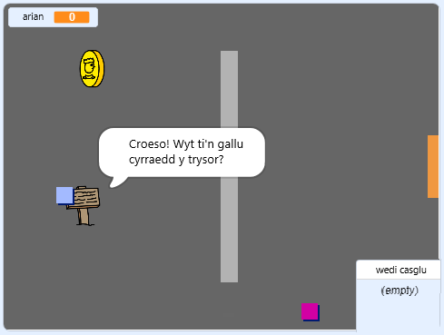

## Beth nesaf?

Rho gynnig ar ein prosiect [Creu dy Fydysawd](https://projects.raspberrypi.org/cy-GB/projects/create-your-own-world?utm_source=pathway&utm_medium=whatnext&utm_campaign=projects), lle byddwch di'n creu dy gêm antur dy hunan!

--- no-print ---

Clicia'r faner werdd i ddechrau. Defnyddia'r bysellau saeth i symud dy gymeriad o gwmpas y byd.

  <iframe allowtransparency="true" width="485" height="402" src="https://scratch.mit.edu/projects/embed/258757783/?autostart=false" frameborder="0" scrolling="no"></iframe>
  

--- /no-print ---

--- print-only ---

Byddi di'n defnyddio'r bysellau saeth i symud dy gymeriad o gwmpas y byd. 

--- /print-only ---