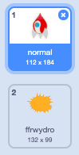
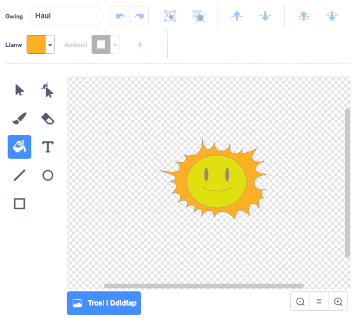

## Ffrwydrad llong ofod

Pan fydd hippo yn cyffwrdd â'r llong ofod, fe ddylai'r llong ofod ffrwydro!

--- task ---

Dewisa corlun y `llong ofod` ac ail-enwi ei wisg yn 'normal'.

--- /task ---

--- task ---

Tynna lun gwisg arall o long ofod yn ffrwydro, a galwa'r wisg newydd yn 'taro'.



Mae modd creu y wisg ‘ffrwydro’ trwy ddefnyddio’r ddelwedd ‘Haul’ o lyfrgell Scratch, a defnyddio **Lliwio siâp** i newid ei liw.



--- /task ---

--- task ---

Ychwanega’r côd yma i dy `long ofod` fel ei fod yn arddangos gwisg 'normal' pan mae'r gêm yn cychwyn, a fel ei fod yn newid gwisg pryd bynnag mae’n cyffwrdd hippo:


```blocks3
pan fo'r flag werdd yn cael ei glicio
newid gwisg i (normal v)
aros hyd at <cyffwrdd (Hippo1 v) ?>
newid gwisg i (ffrwydro v)
```

--- /task ---

--- task ---

Profa’r côd yma trwy ddechrau gêm newydd a tharo hipo. Ydy dy long ofod yn newid i'r wisg 'taro'?

--- /task ---