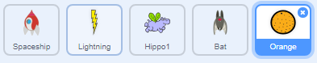

## Ystlumod gofod

Er mwyn gwneud eich gêm yn anoddach, byddwch yn creu ystlum a fydd yn taflu orenau at y llong ofod.


\--- task \---

Bydd angen creu corlun `ystlum` a gosod ei steil cylchdroi o'r **chwith-dde**.

\--- /task \---

\--- task \---

Gwna i'r corlun `Ystlum` i `symud`{:class="block3motion"} o'r chwith i'r dde ar dop y Llwyfan `am byth`{:class="block3control"}.


```blocks3
pan fo'r flag werdd yn cael ei glicio
gosod maint i (50) %
am byth 
  symud (10) cam
  os ar ymyl, bowndio
end
```

Cofia brofi dy gôd.

\--- /task \---

Os wyt ti’n edrych ar wisgoedd yr ystlum, fe weli di fod yna bedwar gwahanol yn barod:


\--- task \---

Defnyddia’r bloc `gwisg nesaf`{:class="block3looks"} i wneud i’r ystlum symud ei adenydd pan mae’n symud.

\--- hints \---

\--- hint \---

Ar ôl i'r ystlum symud, fe ddylai ddangos `gwisg newydd`{:class="block3looks"} ac yna `aros`{:class="block3control"} am amser byr.

\--- /hint \---

\--- hint \---

Mae angen ychwanegu'r blociau yma i dy gôd:

```blocks3
aros (0.3) eiliad

gwisg nesaf
```

\--- /hint \---

\--- hint \---

Your code should look like this:

```blocks3
pan fo'r flag werdd yn cael ei glicio
gosod maint i (50) %
am byth 
  symud (10) cam
  os ar ymyl, bowndio

  + gwisg nesaf
  + aros (0.3) eiliad
end
```

\--- /hint \---

\--- /hints \---

\--- /task \---

Now make the bat throw oranges!

\--- task \---

Add an `Orange` sprite from the Scratch library.



\--- /task \---

\--- task \---

Add code to your bat so that `when the flag is clicked`{:class="block3events"}, the `Bat` sprite `forever`{:class="block3control"} `waits`{:class="block3control"} for a `random`{:class="block3operators"} length of time between `5 to 10`{:class="block3operators"} seconds and then `creates a clone`{:class="block3control"} of the `Orange` sprite.


```blocks3
pan fo'r flag werdd yn cael ei glicio
am byth 
  aros (dewis ar hap (5) i (10)) eiliad
  creu clôn o (Orange v)
end
```

\--- /task \---

\--- task \---

Add code to the `Orange` to make each of its clone drop, starting from the `Bat` sprite and falling towards the bottom of the Stage.


```blocks3
    pan fo'r flag werdd yn cael ei glicio
cuddio

pan rwy'n dechrau fel clôn
mynd i (Bat v)
dangos
ailadrodd hyd at <cyffwrdd (edge v) ?> 
  newid y gan (-4)
end
dileu y clôn hwn
```

\--- /task \---

\--- task \---

Add some more code to the `Orange` sprite so that when an `Orange` clone hits the `Spaceship` sprite, the clone also disappears to give the player a chance to reset:


```blocks3
    pan rwy'n derbyn [ffrwydro v]
dileu y clôn hwn
```

\--- /task \---

\--- task \---

Modify the code of your `Spaceship` sprite so that the sprite is "hit" when it touches a `Hippo` sprite or an `Orange` sprite:


```blocks3
    aros hyd at <<cyffwrdd (Hippo1 v) ?> neu <cyffwrdd (Orange v) ?>>
```

\--- /task \---

\--- task \---

Test your game. What happens if the spaceship gets hit by a falling orange?

\--- /task \---