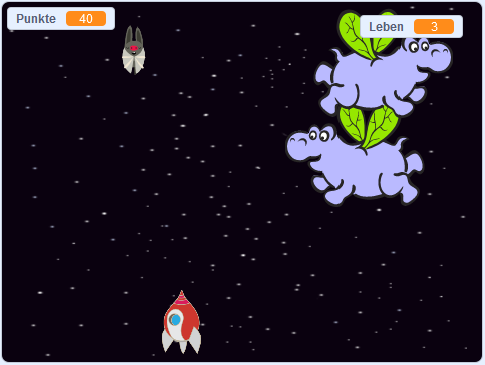

\--- no-print \---

Dies ist die ** Scratch 3 ** Version des Projekts. Es gibt auch eine [ Scratch-2-Version des Projekts ](https://projects.raspberrypi.org/en/projects/clone-wars-scratch2).

\--- /no-print \---

## Einleitung

In diesem Projekt lernst du, wie man ein Spiel erstellt, in dem man die Erde vor Weltraummonstern retten muss.

### Was du machen wirst

\--- no-print \---

Klicken Sie auf die grüne Flagge im folgenden Beispielspiel, um zu beginnen, und drücken Sie dann die Pfeiltasten <kbd>links</kbd> und <kbd>rechts</kbd> , um das Raumschiff zu bewegen, und die Taste <kbd>Leertaste</kbd> , um zu schießen.

  <iframe allowtransparency="true" width="485" height="402" src="https://scratch.mit.edu/projects/embed/276887163/?autostart=false" frameborder="0" scrolling="no"></iframe>
  

\--- /no-print \---

Erziele so viele Punkte wie möglich, indem du fliegende Weltraum-Nilpferde abschießst. Wenn Sie von einem Nilpferd oder einer Orange getroffen werden, die von den Fledermäusen fallen gelassen wird, verlieren Sie ein Leben.

\--- print-only \---

\--- /print-only \---

\--- collapse \---

* * *

## title: Was du brauchen wirst

### Hardware

+ Ein Computer, auf dem Scratch 3 ausgeführt werden kann

### Software

+ Scratch 3 (entweder [online](https://rpf.io/scratchon){:target="_blank"} oder [offline](https://rpf.io/scratchoff){:target="_blank"})

### Downloads

[finden Sie die Downloads](http://rpf.io/p/en/clone-wars-go).

\--- /collapse \---

\--- collapse \---

* * *

## title: Was du lernen wirst

+ So bewegen Sie Sprites mithilfe der Tastatureingabe
+ So klonen Sie Sprites, um Kopien davon zu erstellen
+ Verwendung von "Broadcast" und "Empfangsblöcken" zum Senden von Nachrichten

\--- /collapse \---

\--- collapse \---

* * *

## title: Zusätzliche Hinweise für Pädagogen

\--- no-print \---

Wenn du dieses Projekt ausdrucken möchtest, verwende die [druckerfreundliche Version](https://projects.raspberrypi.org/en/projects/clone-wars/print){:target="_blank"}.

\--- /no-print \---

You can find the [completed project here](http://rpf.io/p/en/clone-wars-get).

\--- /collapse \---