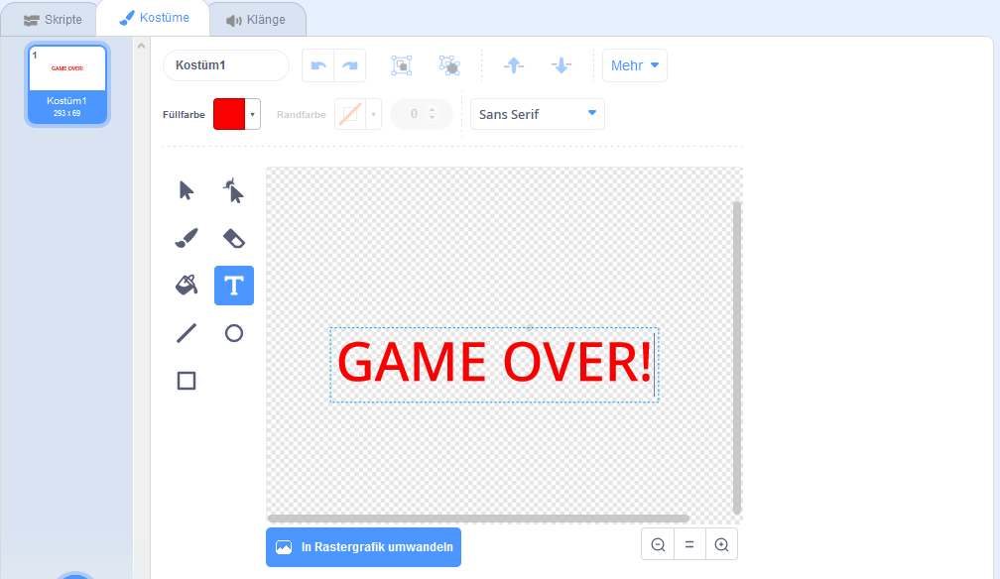

## Spiel ist aus

Als Nächstes fügen Sie am Ende des Spiels eine "Game Over" -Nachricht hinzu.

\--- task \---

Wenn Sie dies noch nicht getan haben, erstellen Sie eine neue Variable mit dem Namen `lebt`{: class = "block3variables"}.

Ihr Raumschiff sollte mit drei Leben beginnen und ein Leben verlieren, wenn es ein Flusspferd oder eine Orange berührt. Dein Spiel sollte aufhören, wenn die `Leben`{: class = "block3variables"} ausgeht.

\--- /task \---

\--- task \---

Zeichnen Sie mit dem **Text-** Tool ein neues Sprite mit dem Namen `Game Over`.



\--- /task \---

\--- task \---

Senden Sie auf der Bühne eine `Spiel-über-`Nachricht ({: class = "block3events"}), bevor das Spiel endet.


```blocks3
broadcast (game over v) und warte
```

\--- /task \---

\--- task \---

Füge diesen Code zu deinem `Game-Over-` Sprite hinzu, sodass er am Ende des Spiels angezeigt wird:


```blocks3
Wenn die Flagge auf
geklickt hat, verstecke

wenn ich [game over v]
show erhalte
```

Da Sie eine `Übertragung (Spielende) verwendet haben und`{: class = "block3events"} Block auf Ihrer Bühne warten, wartet die Bühne, bis das `Game-Over-` Sprite angezeigt wird, bevor Sie das Spiel beenden.

\--- /task \---

\--- task \---

Teste dein Spiel. Wie viele Punkte können Sie erzielen? Wenn das Spiel zu einfach oder zu schwer ist, können Sie Möglichkeiten finden, es zu verbessern?

\--- /task \---