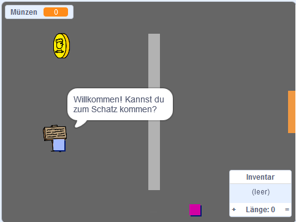

## Zusatzaufgabe: mehr Stifte

Probieren Sie unser [Create your own world](https://projects.raspberrypi.org/en/projects/create-your-own-world?utm_source=pathway&utm_medium=whatnext&utm_campaign=projects) Projekt aus, in dem Sie Ihr eigenes Abenteuerspiel erstellen!

\--- no-print \---

Klicke zum Starten auf die grüne Flagge. Benutze die Pfeiltasten, um deinen Charakter in der Welt zu bewegen.

  <iframe allowtransparency="true" width="485" height="402" src="https://scratch.mit.edu/projects/embed/258757783/?autostart=false" frameborder="0" scrolling="no"></iframe>
  

\--- /no-print \---

\--- print-only \---

Verwenden Sie die Pfeiltasten, um Ihren Charakter in der Welt zu bewegen. 

\--- /print-only \---