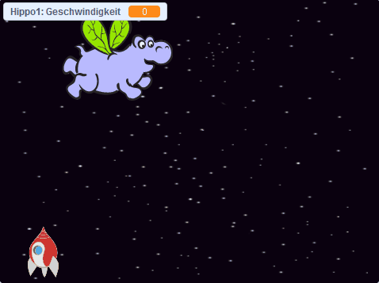

## Flughunde!

Jetzt werden Sie viele fliegende Flusspferde hinzufügen, die versuchen, Ihr Raumschiff zu zerstören.

\--- task \---

Erstellen Sie ein neues Sprite mit dem Bild "Hippo1" in der Scratch-Bibliothek. Verwenden Sie das Werkzeug **Shrink** , um das `Hippo` Sprite auf eine ähnliche Größe wie das `Spaceship` Sprite zu bringen.


\--- /task \---

\--- task \---

Stellen Sie den Rotationsstil des Sprites `Hippo` auf **left-right**.

[[[generic-scratch3-sprite-rotation-style]]]

\--- /task \---

\--- task \---

Füge Code hinzu, um das `Hippo` Sprite zu Beginn des Spiels auszublenden.


```blocks3
Wenn grüne Flagge geklickt 
verstecken
```

\--- /task \---

\--- task \---

Fügen Sie der Bühne Code hinzu, um alle paar Sekunden einen neuen `Hippo` Klon zu erstellen.

\--- hints \---

\--- hint \---

Wenn die grüne Flagge `angeklickt wird`{: class = "block3control"}, `wiederholt`{: class = "block3control"} `warten`{: class = "block3control"} `zwischen 2 und 4 Sekunden`{: class = "block3operators"} und dann `erstellen Sie einen Klon des Hippo-Sprites`{: class = "block3control"}.

\--- /hint \---

\--- hint \---

Hier sind die Blöcke, die Sie benötigen:

```blocks3
für immer
ende

erstelle einen Klon von (Hippo1 v)

(wähle zufällig (2) bis (4))

wenn die Flagge geklickt wird

warte () sek
```

\--- /hint \---

\--- hint \---

So sollte Ihr Code aussehen:


```blocks3
wenn flag geklickt
immer
    wait (pick random (2) bis (4)) secs
    erstellen Klon (Hippo1 v)
Ende
```

\--- /hint \---

\---/hints\---

\--- /task \---

Jeder neue Hippo-Klon sollte an einer zufälligen `x` Position erscheinen und jeder Klon sollte eine zufällige Geschwindigkeit haben.

\--- task \---

Erstellen Sie eine neue Variable mit dem Namen `speed`{: class = "block3variables"}, die nur für das `Hippo` Sprite gilt.

[[[generic-scratch3-add-variable]]]

Wenn Sie dies richtig gemacht haben, hat die Variable den Namen des Sprites daneben, wie folgt:


\--- /task \---

\--- task \---

Wenn jeder `Hippo` Klon startet, wähle eine zufällige Geschwindigkeit und den Startplatz dafür. Zeigen Sie dann den Klon auf dem Bildschirm an.

```blocks3
Wenn ich als Klon
beginne, setze [Geschwindigkeit v] auf (Zufallsauswahl (2) bis (4))
gehe zu x: (Zufallsauswahl (-220) bis (220)) y: (150)
show
```

\--- /task \---

\--- task \---

Testen Sie Ihren Code. Erscheint alle paar Sekunden ein neues Nilpferd?

\--- /task \---

Im Moment bewegen sich die Nilpferde nicht.

\--- task \---

Jedes Nilpferd sollte sich zufällig bewegen, bis es von einem Blitz getroffen wird. Fügen Sie dazu den folgenden Code unter die Blöcke ein, die bereits im Codeskript des `Hippo` Sprites enthalten sind:

```blocks3
Wiederholen, bis <touching (lightning v) ?>
    Bewegung (Geschwindigkeit :: Variablen) Schritte
    Nach rechts drehen (zufällige (-10) bis (10)) Grad
    auswählen, wenn am Rand, Sprung

Diesen Klon löschen
```

\--- /task \---

\--- task \---

Testen Sie Ihren Code erneut. Sie sollten alle paar Sekunden einen neuen Hippo-Klon sehen, und jeder Klon sollte sich mit einer anderen Geschwindigkeit bewegen.

\--- no-print \---



\--- /no-print \---

\--- /task \---

\--- task \---

Testen Sie nun die Laserkanone des Raumschiffs. Wenn ein Blitz ein Flusspferd trifft, verschwindet das Flusspferd?

\--- /task \---