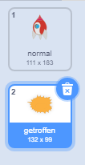
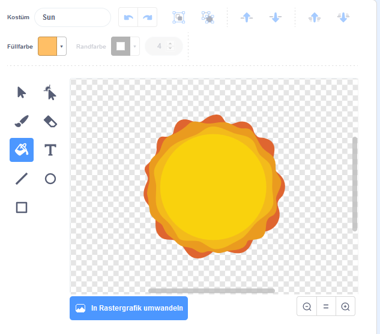

## Game over

Wenn ein Nilpferd Ihr Raumschiff berührt, sollte das Raumschiff explodieren!

\--- task \---

Wählen Sie das Sprite `Spaceship` und benennen Sie das Kostüm in "normal" um.

\--- /task \---

\--- task \---

Zeichnen Sie ein weiteres Kostüm eines explodierenden Raumschiffs und nennen Sie das neue Kostüm "Hit".



Wenn Sie die Explosion nicht zeichnen möchten, können Sie das Kostüm 'Sonne' aus der Scratch-Bibliothek auswählen und dann mit dem Werkzeug **Farbe eine Form** die Farbe und das Gesicht des Kostüms ändern.



\--- /task \---

\--- task \---

Fügen Sie Ihrem `Spaceship` Sprite Code hinzu, sodass es zu Beginn des Spiels das „normale“ Kostüm anzeigt und zum „Hit“ -Kostüm wechselt, wenn es ein Nilpferd berührt:


```blocks3
wenn Flagge geklickt
Kostüm wechseln zu (normal v)
warten bis <touching (Hippo1 v)>?
Kostüm wechseln zu (Hit V)
```

\--- /task \---

\--- task \---

Testen Sie Ihren Code. Lass das Raumschiff mit einem Nilpferd kollidieren. Ändert sich das Raumschiff zum "Hit" -Kostüm?

\--- /task \---