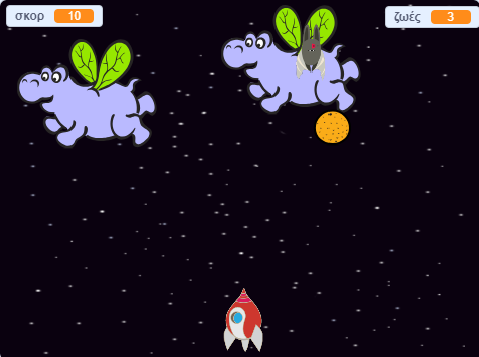

--- no-print ---

Αυτή είναι η έκδοση **Scratch 3** του έργου. Υπάρχει επίσης και μία έκδοση [Scratch 2](https://projects.raspberrypi.org/el-GR/projects/clone-wars-scratch2) του έργου.

--- /no-print ---

## Εισαγωγή

Σε αυτό το έργο θα μάθεις πώς να δημιουργήσεις ένα παιχνίδι στο οποίο θα πρέπει να σώσεις τη Γη από τα τέρατα του διαστήματος.

### Τι θα φτιάξεις

--- no-print ---

Κάνε κλικ στην πράσινη σημαία στο παράδειγμα παρακάτω για να ξεκινήσεις και, στη συνέχεια, πάτησε το <kbd>αριστερό</kbd> και το <kbd>δεξί</kbd> πλήκτρο βέλους για να μετακινήσεις το διαστημόπλοιο και το <kbd>κενό</kbd> πλήκτρο για να πυροβολήσει.

  <iframe allowtransparency="true" width="485" height="402" src="https://scratch.mit.edu/projects/embed/276887163/?autostart=false" frameborder="0" scrolling="no"></iframe>
  

--- /no-print ---

Απόκτησε όσο περισσότερους πόντους μπορείς, πυροβολώντας ιπτάμενους διαστημικούς ιπποπόταμους. Θα χάσεις μια ζωή αν χτυπηθείς από έναν ιπποπόταμο ή από τα πορτοκάλια που πετούν οι φρουτονυχτερίδες.

--- print-only ---

--- /print-only ---

--- collapse ---
---
title: Τι θα χρειαστείς
---

### Υλικό

+ Ένας υπολογιστής ικανός να τρέχει το Scratch 3

### Λογισμικό

+ Scratch 3 (είτε [online](https://rpf.io/scratchon){:target="_blank"} είτε [offline](https://rpf.io/scratchoff){:target="_blank"})

### Λήψεις

[Βρες τις λήψεις εδώ](http://rpf.io/p/el-GR/clone-wars-go).

--- /collapse ---

--- collapse ---
---
title: Τι θα μάθεις
---

+ Πώς θα κάνεις τους χαρακτήρες να κινούνται με τη χρήση του πληκτρολόγιου
+ Πώς θα δημιουργήσεις αντίγραφα των χαρακτήρων
+ Πώς να χρησιμοποιήσεις τη λειτουργία "εκπομπή" και "λήψη μπλοκ" για την αποστολή μηνυμάτων

--- /collapse ---

--- collapse ---
---
title: Πρόσθετες σημειώσεις για εκπαιδευτικούς
---

--- no-print ---

Αν χρειαστεί να εκτυπώσεις αυτό το έργο, χρησιμοποίησε την [εκτυπώσιμη έκδοση](https://projects.raspberrypi.org/el-GR/projects/clone-wars/print){:target="_blank"}.

--- /no-print ---

Μπορείς να βρεις [το ολοκληρωμένο έργο εδώ](http://rpf.io/p/el-GR/clone-wars-get).

--- /collapse ---