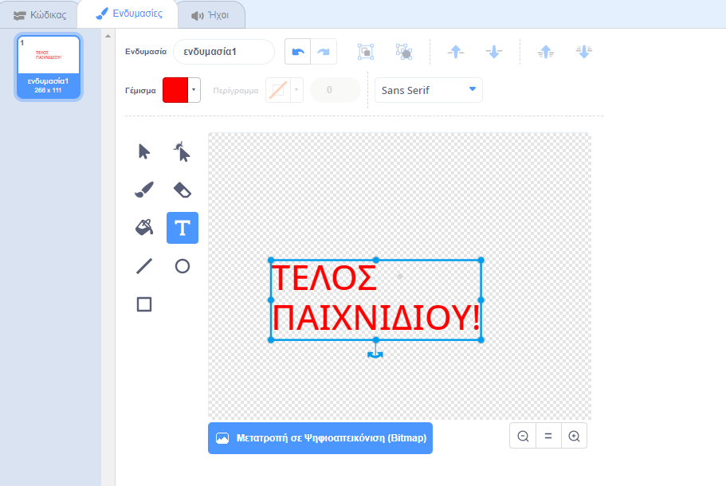
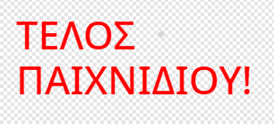

## Τέλος παιχνιδιού

Ας προσθέσουμε ένα μήνυμα 'τέλος παιχνιδιού' όταν ολοκληρωθεί.

--- task ---

Αν δεν το έχεις κάνει ήδη, δημιούργησε μια νέα μεταβλητή που ονομάζεται `ζωές`{:class="blockdata"}.

Το διαστημόπλοιό σου πρέπει να ξεκινήσει με τρεις ζωές και να χάνει μια ζωή όποτε αγγίζει έναν ιπποπόταμο ή ένα πορτοκάλι. Το παιχνίδι σου πρέπει να σταματήσει όταν η μεταβλητή `ζωές`{:class="block3variables"} μηδενιστεί.

--- /task ---

--- task ---

Σχεδίασε ένα νέο χαρακτήρα με το όνομα `Τέλος Παιχνιδιού` χρησιμοποιώντας το εργαλείο **κειμένου**.



--- /task ---

--- task ---

Στο σκηνικό σου, μεταδίδεις ένα μήνυμα `τέλος παιχνιδιού`{:class="block3events"} λίγο πριν τελειώσει το παιχνίδι.


```blocks3
μετάδωσε (game over v) και περίμενε
```

--- /task ---

--- task ---

Πρόσθεσε αυτόν τον κώδικα στο χαρακτήρα `Τέλος Παιχνιδιού`, έτσι ώστε το μήνυμα να εμφανίζεται στο τέλος του παιχνιδιού:



```blocks3
Όταν στην πράσινη σημαία γίνει κλικ
εξαφανίσου

όταν λάβω [game over v]
εμφανίσου
```

Επειδή έχεις χρησιμοποιήσει ένα μπλοκ `μετάδωσε (game over v) και περίμενε`{:class="block3events"} στο σκηνικό σου, θα περιμένει να εμφανιστεί ο χαρακτήρας `Τέλος Παιχνιδιού` πριν τελειώσει το παιχνίδι.

--- /task ---

--- task ---

Δοκίμασε το παιχνίδι σου. Πόσους πόντους μπορείς να πετύχεις; Εάν είναι πολύ εύκολο ή πολύ δύσκολο, μπορείς να σκεφτείς τρόπους για να βελτιώσεις το παιχνίδι σου;

--- /task ---