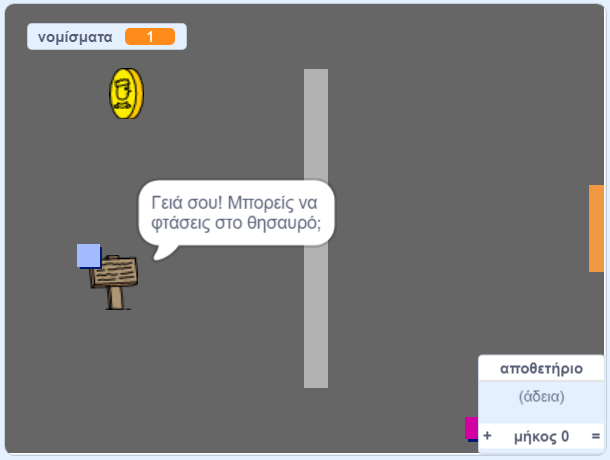

## Και τώρα;

Δοκίμασε το έργο [Φτιάξε το δικό σου κόσμο](https://projects.raspberrypi.org/en/projects/create-your-own-world?utm_source=pathway&utm_medium=whatnext&utm_campaign=projects), για να δημιουργήσεις το δικό σου παιχνίδι περιπέτειας!

\--- no-print \---

Πάτα στην πράσινη σημαιούλα για να ξεκινήσεις. Χρησιμοποίησε τα βελάκια στο πληκτρολόγιο για να μετακινήσεις το χαρακτήρα σου στον κόσμο.

  <iframe allowtransparency="true" width="485" height="402" src="https://scratch.mit.edu/projects/embed/258757783/?autostart=false" frameborder="0" scrolling="no"></iframe>
  

\--- /no-print \---

\--- print-only \---

Θα χρησιμοποιήσεις τα βελάκια στο πληκτρολόγιο για να μετακινήσεις το χαρακτήρα σου στον κόσμο. 

\--- /print-only \---