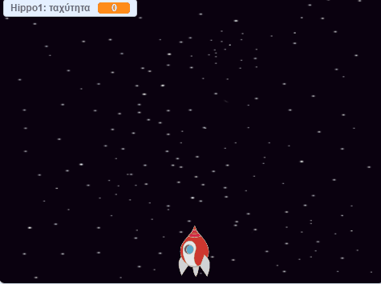

## Διαστημικοί ιπποπόταμοι

Ας προσθέσουμε αρκετούς ιπτάμενους ιπποπόταμους που θα προσπαθήσουν να καταστρέψουν το διαστημόπλοιο σου.

\--- task --

Δημιούργησε ένα νέο χαρακτήρα με την εικόνα 'Hippo1' στη βιβλιοθήκη Scratch. Χρησιμοποίησε το εργαλείο **συρρίκνωσης** για να φέρεις το χαρακτήρα του `ιπποπόταμου` σε παρόμοιο μέγεθος με το χαρακτήρα του `διαστημόπλοιου`.


\--- /task \---

\--- task --

Ρύθμισε το στυλ περιστροφής του χαρακτήρα `Hippo` ώστε να είναι μόνο **αριστερά προς δεξιά**.

[[[generic-scratch3-sprite-rotation-style]]]

\--- /task \---

\--- task --

Πρόσθεσε κώδικα για να κρύψεις τον χαρακτήρα `Hippo` όταν ξεκινήσει το παιχνίδι.


```blocks3
when green flag clicked
hide
```

\--- /task \---

\--- task --

Πρόσθεσε κώδικα στο σκηνικό για να δημιουργείς έναν νέο `ιπποπόταμο` κάθε λίγα δευτερόλεπτα.

\--- hints \---

\--- hint \---

When the `green flag is clicked`{:class="block3events"}, `repeatedly`{:class="block3control"} `wait`{:class="block3control"} `between 2 and 4 seconds`{:class="block3operators"} and then `create a clone of the Hippo sprite`{:class="block3control"}.

\--- /hint \---

\--- hint \---

Εδώ είναι τα μπλοκ που χρειάζεσαι:

```blocks3
forever
end

create clone of (Hippo1 v)

(pick random (2) to (4))

when flag clicked

wait () secs
```

\--- /hint \---

\--- hint \---

Έτσι πρέπει να φαίνεται ο κώδικάς σου:


```blocks3
when flag clicked
forever
    wait (pick random (2) to (4)) secs
    create clone of (Hippo1 v)
end
```

\--- /hint \---

\--- /hints \---

\--- /task \---

Κάθε νέος ιπποπόταμος πρέπει να εμφανίζεται σε τυχαία θέση `x` και να έχει τυχαία ταχύτητα.

\--- task --

Δημιούργησε μια νέα μεταβλητή που ονομάζεται `ταχύτητα`{:class="block3variables"} η οποία θα είναι μόνο για τον χαρακτήρα `Hippo`.

[[[generic-scratch3-add-variable]]]

Θα γνωρίζεις ότι το έχεις κάνει σωστά όταν βλέπεις ότι η μεταβλητή έχει το όνομα του χαρακτήρα δίπλα σε αυτήν, όπως παρακάτω:


\--- /task \---

\--- task --

Όταν ξεκινά ο κάθε κλώνος `ιπποπόταμου`, επίλεξε μια τυχαία ταχύτητα και ένα τυχαίο σημείο εκκίνησης. Μετά εμφάνισε τον κλώνο στην οθόνη.

```blocks3
when I start as a clone
set [speed v] to (pick random (2) to (4))
go to x: (pick random (-220) to (220)) y: (150)
show
```

\--- /task \---

\--- task --

Δοκίμασε τον κώδικά σου. Εμφανίζεται ένας νέος ιπποπόταμος κάθε λίγα δευτερόλεπτα;

\--- /task \---

Αυτή τη στιγμή οι ιπποπόταμοι δεν κινούνται.

\--- task --

Κάθε ιπποπόταμος πρέπει να κινηθεί τυχαία μέχρι να χτυπηθεί από μία αστραπή. Για να γίνει αυτό, τοποθέτησε αυτόν τον κώδικα κάτω από τα μπλοκ που βρίσκονται ήδη στο κώδικα του `ιπποπόταμου`:

```blocks3
repeat until <touching (lightning v) ?>
    move (speed :: variables) steps
    turn right (pick random (-10) to (10)) degrees
    if on edge, bounce
end
delete this clone
```

\--- /task \---

\--- task --

Δοκίμασε ξανά τον κώδικά σου. Θα δεις έναν καινούργιο κλώνο ιπποπόταμο να εμφανίζεται κάθε λίγα δευτερόλεπτα και κάθε κλώνος θα πρέπει να κινείται με διαφορετική ταχύτητα.

\--- no-print \---



\--- /no-print \---

\--- /task \---

\--- task --

Τώρα δοκίμασε το κανόνι λέιζερ του διαστημόπλοιου. Εάν μία αστραπή χτυπά έναν ιπποπόταμο, ο ιπποπόταμος εξαφανίζεται;

\--- /task \---