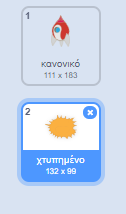

## Έκρηξη διαστημόπλοιου

Όταν ένας ιπποπόταμος αγγίζει το διαστημόπλοιο σου, το σκάφος πρέπει να εκραγεί!

--- task ---

Επίλεξε το χαρακτήρα `Spaceship` και μετονόμασε την εμφάνιση σε «κανονική».

--- /task ---

--- task ---

Σχεδίασε μια νέα εμφάνιση ενός διαστημόπλοιου που εκρήγνυται και ονόμασε τη νέα εμφάνιση "χτυπημένο".



Αν δεν θέλεις να σχεδιάσεις την έκρηξη, μπορείς να επιλέξεις την εμφάνιση 'Sun' από τη βιβλιοθήκη Scratch και να χρησιμοποιήσεις το εργαλείο **Ζωγράφισε ένα σχέδιο** για να αλλάξεις το χρώμα του και να αφαιρέσεις το πρόσωπο.


--- /task ---

--- task ---

Πρόσθεσε κώδικα στον χαρακτήρα του `διαστημόπλοιου` έτσι ώστε να εμφανίζει την «κανονική» εμφάνιση όταν ξεκινά το παιχνίδι και να αλλάζει στην εμφάνιση "χτυπημένο" όταν αγγίζει έναν ιπποπόταμο:


```blocks3
Όταν στην πράσινη σημαία γίνει κλικ
άλλαξε ενδυμασία σε (normal v)
περίμενε ώσπου <touching (Hippo1 v)>
άλλαξε ενδυμασία σε (hit v)
```

--- /task ---

--- task ---

Δοκίμασε τον κώδικα παίζοντας το παιχνίδι και άσε το διαστημόπλοιο να συγκρουστεί με έναν ιπποπόταμο. Όντως το διαστημόπλοιο αλλάζει την εμφάνισή του στην εμφάνιση «χτυπημένο»;

--- /task ---