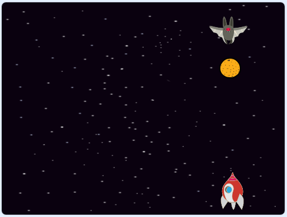

## Διαστημική νυχτερίδα

Για να γίνει το παιχνίδι λίγο πιο δύσκολο, ας δημιουργήσουμε μία φρουτονυχτερίδα που ρίχνει πορτοκάλια στο διαστημόπλοιο.



\--- task --

Πρόσθεσε ένα χαρακτήρα νυχτερίδα `Bat` και ρύθμισε το στυλ περιστροφής του μόνο σε **αριστερά-δεξιά**.

\--- /task \---

\--- task --

Κάνε τον χαρακτήρα `Bat` να `μετακινείται`{:class="block3motion"} από τη μία άκρη στην κορυφή του σκηνικού, στην άλλη `για πάντα`{:class="block3control"}. Θυμήσου να δοκιμάσεις τον κώδικα σου.


```blocks3
Όταν στην πράσινη σημαία γίνει κλικ
όρισε μέγεθος σε (50) %
για πάντα 
  κινήσου (10) βήματα
  εάν σε όριο, αναπήδησε
end
```

Θυμήσου να δοκιμάσεις τον κώδικά σου.

\--- /task \---

Αν κοιτάξεις τις εμφανίσεις της νυχτερίδας, θα δεις ότι έχει ήδη δύο διαφορετικές:


\--- task --

Χρησιμοποίησε το μπλοκ `επόμενη εμφάνιση`{:class="block3looks"} για να κάνεις τη νυχτερίδα να κουνάει τα φτερά της καθώς κινείται.

\--- hints \---

\--- hint \---

Αφού κινηθεί η νυχτερίδα, θα δείξει την `επόμενη εμφάνιση`{:class="block3looks"} και στη συνέχεια θα `περιμένει`{:class="block3control"} για λίγο.

\--- /hint \---

\--- hint \---

Θα πρέπει να προσθέσεις αυτά τα μπλοκ στον κώδικά σου:

```blocks3
περίμενε (0.3) δευτερόλεπτα

επόμενη ενδυμασία
```

\--- /hint \---

\--- hint \---

Your code should look like this:

```blocks3
Όταν στην πράσινη σημαία γίνει κλικ
όρισε μέγεθος σε (50) %
για πάντα 
  κινήσου (10) βήματα
  εάν σε όριο, αναπήδησε
  + επόμενη ενδυμασία
  + περίμενε (0.3) δευτερόλεπτα
end
```

\--- /hint \---

\--- /hints \---

\--- /task \---

Now make the bat throw oranges!

\--- task \---

Add an `Orange` sprite from the Scratch library.


\--- /task \---

\--- task \---

Add code to your bat so that `when the flag is clicked`{:class="block3events"}, the `Bat` sprite `forever`{:class="block3control"} `waits`{:class="block3control"} for a `random`{:class="block3operators"} length of time between `5 to 10`{:class="block3operators"} seconds and then `creates a clone`{:class="block3control"} of the `Orange` sprite.


```blocks3
Όταν στην πράσινη σημαία γίνει κλικ
για πάντα 
  περίμενε (επίλεξε τυχαίο (5) εώς (10)) δευτερόλεπτα
  δημιούργησε κλώνο του (Orange v)
end
```

\--- /task \---

\--- task \---

Add code to the `Orange` to make each of its clone drop, starting from the `Bat` sprite and falling towards the bottom of the Stage.


```blocks3
    Όταν στην πράσινη σημαία γίνει κλικ
εξαφανίσου

όταν ξεκινήσω ως κλώνος
πήγαινε σε (Bat v)
εμφανίσου
επανάλαβε ώσπου <αγγίζει (edge v) ;> 
  άλλαξε y κατά (-4)
end
διάγραψε αυτόν τον κλώνο
```

\--- /task \---

\--- task \---

Add some more code to the `Orange` sprite so that when an `Orange` clone hits the `Spaceship` sprite, the clone also disappears to give the player a chance to reset:


```blocks3
    όταν λάβω [hit v]
διάγραψε αυτόν τον κλώνο
```

\--- /task \---

\--- task \---

Modify the code of your `Spaceship` sprite so that the sprite is "hit" when it touches a `Hippo` sprite or an `Orange` sprite:


```blocks3
    περίμενε ώσπου < <touching (Hippo1 v)?> ή <touching (Orange v)?>>
```

\--- /task \---

\--- task \---

Test your game. What happens if the spaceship gets hit by a falling orange?

\--- /task \---