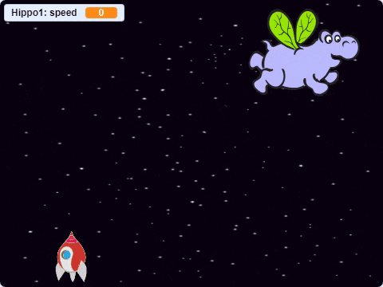

## Flying space-hippos

Let's add lots of flying hippos that are trying to destroy your spaceship.

+ Create a new sprite with the 'Hippo1' image in the Scratch library. Use the shrink tool to make the hippo a similar size to the spaceship.


+ Set the hippo sprite's rotation style to be left-right only

[[[generic-scratch-sprite-rotation-style]]]

+ Add some code to hide the hippo when the game starts.

--- hints ---
--- hint ---
The code for this is exactly the same as the code you used to hide the lightning bolt when the game starts.
--- /hint ---
--- hint ---
Here is the code you will need:

```blocks
when green flag clicked
hide
```
--- /hint ---
--- /hints ---

+ Switch to the **stage** by clicking on it in the bottom panel:

+ Add this code to the stage to create a new hippo every few seconds:

```blocks
when flag clicked
forever
	wait (pick random (2) to (4)) secs
	create clone of [Hippo1 v]
end
```

+ Switch back to the **hippo** sprite

Each new hippo that appears should move randomly around the screen, and each should have a different speed.

+ Create a new variable called `speed`{:class="blockdata"}, that is for the hippo sprite only.

[[[generic-scratch-add-variable]]]

You'll know if you've done this correctly because the variable will have the name of the sprite next to it, like this:


+ When each hippo clone starts, pick a random speed and starting place before showing it on the screen

```blocks
when I start as a clone
set [speed v] to (pick random (2) to (4))
go to x: (pick random (-220) to (220)) y: (150)
show
```

+ Test your code by clicking the green flag. Does a new hippo appear every few seconds? At the moment your hippos won't move.

+ The hippo should move around randomly until it gets hit by a lightning bolt. Attach this code underneath the code you just added:

```blocks
repeat until <touching [lightning v] ?>
	move (speed) steps
	turn right (pick random (-10) to (10)) degrees
	if on edge, bounce
end
delete this clone
```

+ Test out your hippo code. You should see a new hippo clone appear every few seconds, each moving at its own speed.

	

+ Test your laser cannon. If you hit a hippo, does it vanish?
