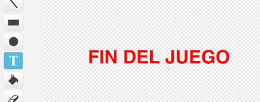
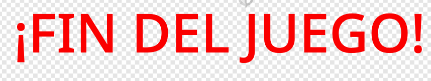

## Fin del juego

A continuación, vas a añadir un mensaje de "fin del juego" al final del juego.

--- task ---

Si aún no lo has hecho, crea una nueva variable llamada `vidas`{:class="block3variables"}.

Tu nave espacial debe comenzar con tres vidas y perder una vida cuando toca un hipopótamo o una naranja. Tu juego debería detenerse cuando se acaben las `vidas`{:class="block3variables"}.

--- /task ---

--- task ---

Dibuja un nuevo objeto llamado `fin del juego` usando la herramienta **texto**.



--- /task ---

--- task ---

En el escenario, envía un mensaje `fin del juego`{:class="block3events"} justo antes de que finalice el juego.


```blocks3
enviar (fin del juego v) y esperar
```

--- /task ---

--- task ---

Añade este código a tu objeto `fin del juego` para que se muestre al final del juego:



```blocks3
al presionar bandera verde
esconder

al recibir [fin del juego v]
mostrar
```

Porque has usado un bloque `enviar (fin del juego) y esperar`{:class="block3events"} en tu escenario, el escenario esperará a que el objeto `fin del juego` se muestre antes de finalizar la partida.

--- /task ---

--- task ---

Prueba tu juego. ¿Cuántos puntos puedes anotar? Si el juego es demasiado fácil o demasiado difícil, ¿puedes pensar en formas de mejorarlo?

--- /task ---