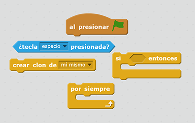
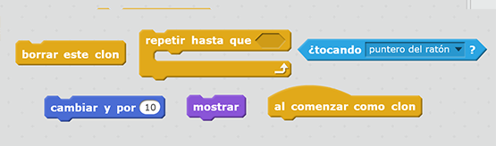

## Relámpagos

¡Vamos a dar a la nave espacial la capacidad de disparar relámpagos!

+ Añade el sprite `relámpago` de la biblioteca Scratch.

+ Cuando se inicia el juego, el sprite `relámpago` debe quedar oculto hasta que la nave espacial dispara su cañónes láser, así que añade este código al sprite `relámpago`:

```blocks
al presionar la bandera verde
oculta
```

¡En este momento tienes un relámpago gigantesco que la nave espacial puede disparar!

+ Añade alguno código debajo de los bloques acabas de añadir para hacer el sprite `relámpago` más pequeño y darlo la vuelta. Entonces se verá como dispara primero el extremo puntiagudo de la nave espacial.

```blocks
configura el tamaño a (25) %
apunta hacia la dirección (-90 v)
```

+ Cambiar al sprite `nave espacial` haciendo clic en el panel de sprites debajo del escenario.

+ Añade alguno código nuevo para hacer que la `nave espacial` cree un relámpago nuevo cuando se presiona la barra de **espacio**.

\--- hints \--- \--- hint \--- Aqui está alguno pseudocódigo para ti:

Cuando se hace clic en la bandera verde Sigue revisando forever Si se presiona la barra de **espacio**, crea un clon del sprite `relámpago` \--- /hint \--- \--- hint \--- Aqui están los bloques que necesitarás:

 \--- /hint \--- \--- hint \--- Aquí está el código que necesitarás:

```blocks
cuando se hace clic en la bandera
para siempre
    si <key [space v] pressed?> luego
        crea clon de [relámpago v]
    fin
fin
```

\--- /hint \--- \--- /hints \---

+ Regresa al sprite `relámpago`.

+ Cada vez que un relámpago es creado, debería aparecer y luego moverse hacia arriba hasta que llegue a la parte superior de la pantall. Entonces debería desaparecer.

\--- hints \--- \--- hint \---

Cuando aparece un nuevo clon del sprite `relámpago`:

+ Muestralo
+ Repetidamente muevelo hacia arriba por `10` hasta que toque el borde de la pantalla
+ Luego, elimina el clon \--- /hint \--- \--- hint \--- Aquí están los bloques que necesitarás:

 \--- /hint \--- \--- hint \--- Aquí esta el código que necesitarás para añadir el sprite `relámpago`:

```blocks
    cuando empiezo como un clon
    muestra
    repite hasta <touching [edge v] ?>
        cambia y por (10)
    fin
    elimina este clon
```

\--- /hint \--- \--- /hints \---

+ Prueba tu sprite `relámpago` haciendo clic en la bandera verde y luego presionando la barra de **espacio**. ¿Cuando presionas **espacio**, aparece un relápago y sube la pantalla? ¿Qué problema puedes detectar?

## \--- collapse \---

## title: Respuesta

¡Uy — en este momento el relámpago dispara siempre desde el mismo lugar, sin importar de dónde está la nave espacial!

Agregue este bloque antes del bloque `muestra`{:class="blocklooks"} para hacer que el clon del sprite `relámpago` se mueva a la posición del sprite `nave` antes de que aparezca. Asía parecerá como si el relámpago está disparando desde la nave espacial.

```blocks
ve a [nave espacial v]
```

\--- /collapse \---

+ Presiona la barra de **espacio** para probar si tu relámpago ya se dispara correctamente.

\--- challenge \---

### Desafío: arreglar el relámpago

¿Qué sucede si mantienes presionada la barra de **espacio**? ¿Puedes utilizar un bloque `esperar` {:class="blockcontrol"} para solucionar este problema?

\--- /challenge \---