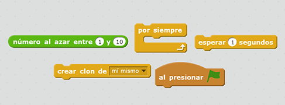
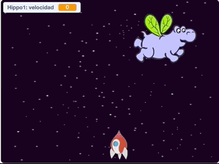

## Hipopótamos espaciales voladores

Agreguemos muchos hipopótamos voladores que intentarán destruir tu nave espacial.

+ Crea un nuevo sprite con el imagen `hippo1` en la biblioteca Scratch. Utiliza la herramienta **shrink** para hacer que el sprite `hippo` sea un tamaño similar al sprite `nave espacial`.


+ Establece el estilo de la rotación del sprite `hippo` para hacerlo izquierda a derecha solamente.

[[[generic-scratch-sprite-rotation-style]]]

+ Agregue un código para ocultar el sprite `hippo` cuando comienza el juego.

\--- hints \--- \--- hint \--- El código para esto es exactamente el mismo quel el código que utilizaste para ocultar el sprite `relámpago` cuando comienza el juego. \--- /hint \--- \--- hint \--- Aquí está el código que necesitarás:

```blocks
al presionar la bandera verde
oculta
```

\--- /hint \--- \--- /hints \---

+ Cambia al escenario haciendo clic en él en el panel inferior.

+ Agregue un código al escenario para crear un nuevo hipopótamo cada pocos segundos.

\--- hints \--- \--- hint \--- Cuando se hace clic en la bandera verde: Repetidamente...

+ Espera entre 2 y 4 segundos
+ Crea un clon del sprite de hipopótamo

\--- /hint \--- \--- hint \--- Aquí están los bloques que necesitarás: 

\--- /hint \--- \--- hint \--- Aquí está el código que necesitarás:

```blocks
al presionar la bandera
para siempre
    espera (elige un número aleatorio de segundas entre (2) y (4))
    crea un clon de [Hippo1 v]
fin
```

\--- /hint \--- \--- /hints \---

+ Regresa al sprite `hipopótamo`.

Cada nuevo hipopótamo debe aparecer en una posición aleatoria x, y cada uno debe tener una velocidad aleatoria.

+ Crea una nueva variable que se llama `velocidad`{:class="blockdata"} que es solo para el sprite `hipopótamo`.

[[[generic-scratch-add-variable]]]

Sabrás que has hecho esto correctamente cuando puedes ver que la variable tiene el nombre del sprite al lado, así:


+ Cuando se inicia cada clon de hipopótamo, escoge una velocidad aleatoria y un punto de partida antes de mostrarlo en la pantalla.

```blocks
al comenzar como un clon
determina [speed v] para (escoger random (2) a (4))
ve a x: (escoger random (-220) a (220)) y: (150)
muestra
```

+ Prueba el código haciendo clic en la bandera verde. ¿El hipopótamo nuevo aparece cada pocos segundos? Por el momento no se moverá los hipopótamos.

+ El hipopótamo debe moverse al azar hasta que sea atropellado por un relámpago. Para que esto suceda, coloca este código debajo de los bloques que acabas de agregar:

```blocks
repite hasta <touching [lightning v] ?>
    mueva (velocidad) pasos
    girar a la derecha (escoge random (-10) a (10)) grados
    si en el borde, rebota
fin
elimina este clon
```

+ Prueba el código de hipopótamo. Debe aparecer un nuevo clon de hipopótamo cada pocos segundos, cada movimiento a su propia velocidad.
    
    

+ Prueba su cañón láser. Si golpeas a un hipopótamo, ¿desaparece?