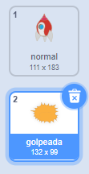
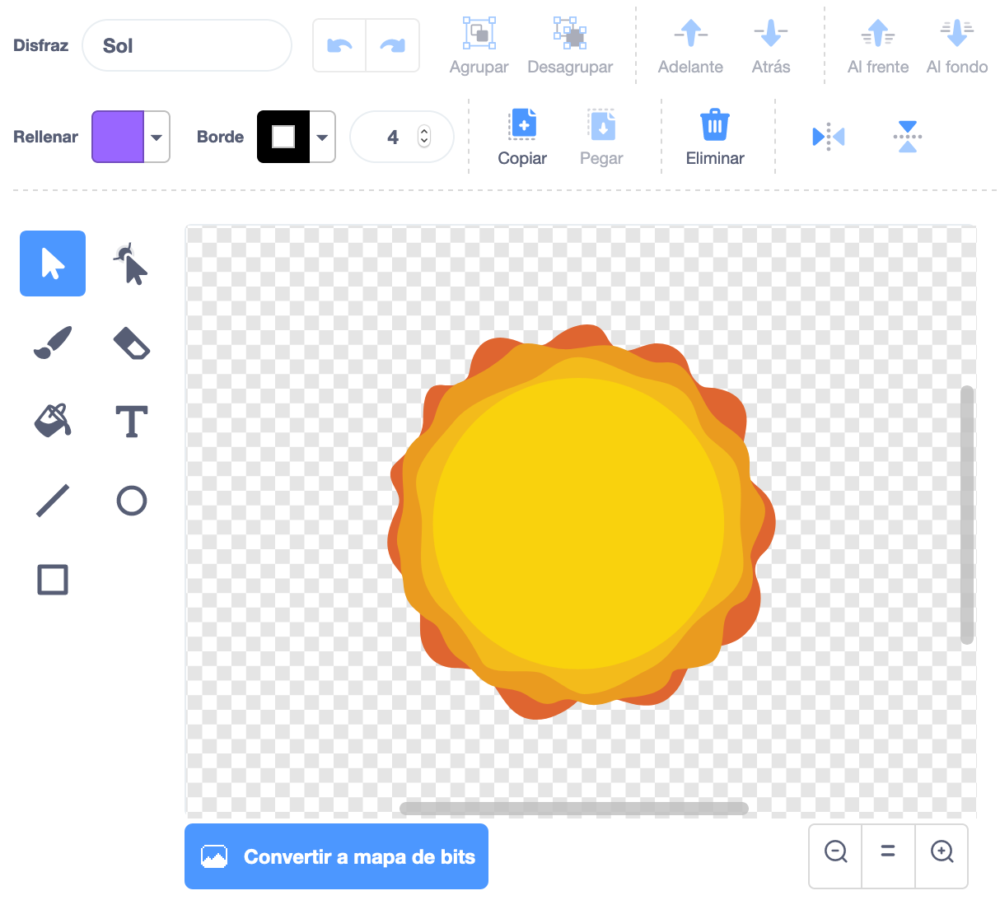

## Nave espacial explosiva

Cuando un hipopótamo toca tu nave espacial, la nave debe explotar!

+ Selecciona el sprite `nave espacial` y renombra el disfrace a 'normal'.

+ Dibuja otro disfraz de la explosión de la nave espacial y lo llama 'hit'.



O, si no quieres dibujar la explosión, podrías elegir el disfraz 'sol' de la biblioteca Scratch y utilizar la herramienta **Colora una forma** para cambiar su color y sacar la cara.



+ Agrega un código a tu sprite `nave espacial` para que empieza mostrando el traje de la nave espacial, pero cuando toca un hipopótamo volador, cambie el traje de 'hit':

```blocks
al presionar la bandera
cambia el disfraz a [normal v]
espera hasta que <touching [Hippo1 v]>?
cambia el disfraz a [hit v]
```

+ Prueba tu código jugando y chocando con un hipopótamo. ¿La nave espacial cambia al disfraz 'hit'?