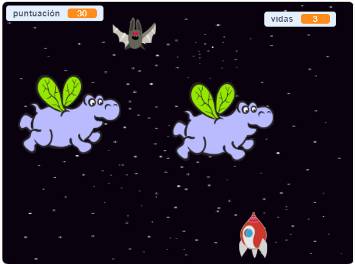

\--- no imprimir \---

Esta es la versión **Scratch 3** del proyecto. También existe una version [Scratch 2 del proyecto](https://projects.raspberrypi.org/en/projects/clone-wars-scratch2).

\--- /no-print \---

## Introducción

In this project you will learn how to create a game in which you have to save the Earth from space monsters.

### Lo que hará

\--- no imprimir \---

Click the green flag in the example game below to start, and then press the <kbd>left</kbd> and <kbd>right</kbd> arrow keys to move the spaceship, and the <kbd>space</kbd> key to shoot.

  <iframe allowtransparency="true" width="485" height="402" src="https://scratch.mit.edu/projects/embed/276887163/?autostart=false" frameborder="0" scrolling="no"></iframe>
  

\--- /no-imprimir \---

Score as many points as you can by shooting flying space-hippos. If you get hit by a hippo or by an orange dropped by the bats, you lose a life.

\--- print-only \---

\--- /print-only \---

\--- collapse \---

* * *

## título: Lo que necesitarás

### Equipo

+ Una computadora capáz de hacer funcionar el Scratch 3

### Programa

+ Scratch 3 (ya sea [con conexión](https://rpf.io/scratchon){:target="_blank"} o [sin conexión](https://rpf.io/scratchoff){:target="_blank"})

### Descargas

[Find the downloads here](http://rpf.io/p/en/clone-wars-go).

\--- /collapse \---

\--- collapse \---

* * *

## title: Lo que vas a aprender

+ How to make sprites move using keyboard input
+ How to clone sprites to make copies of them
+ How to use 'broadcast' and 'receive blocks' to send messages

\--- /collapse \---

\--- collapse \---

* * *

## título: Notas adicionales para educadores

\--- no imprimir \---

Si necesitas imprimir este proyecto, por favor utiliza la [versión de impresión amigable](https://projects.raspberrypi.org/en/projects/clone-wars/print){:target="_blank"}.

\--- /no-print \---

Puedes [ descargar el proyecto completo aquí ](http://rpf.io/p/en/clone-wars-get).

\--- /collapse \---