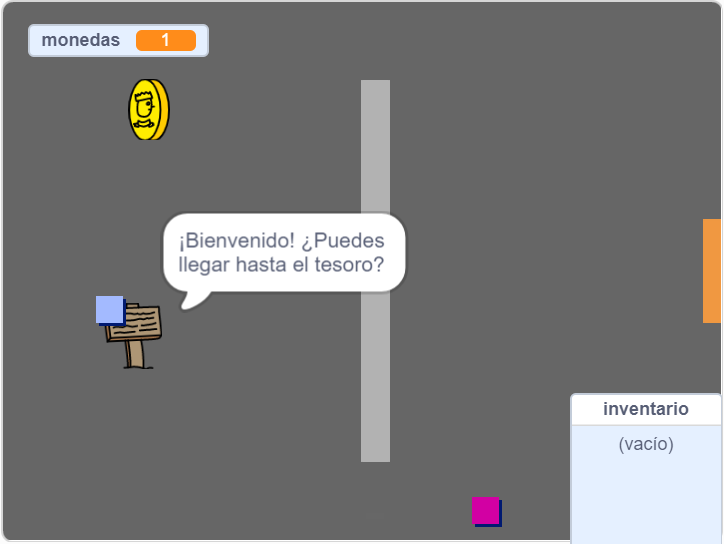

## ¿Qué sigue?

Prueba nuestro proyecto [Crea tu propio mundo](https://projects.raspberrypi.org/en/projects/create-your-own-world?utm_source=pathway&utm_medium=whatnext&utm_campaign=projects), ¡en el que crearás tu propio juego de aventuras!

\--- no-print \---

Haz clic en la bandera verde para empezar. Utiliza las teclas de flecha para mover a tu personaje por el mundo.

  <iframe allowtransparency="true" width="485" height="402" src="https://scratch.mit.edu/projects/embed/258757783/?autostart=false" frameborder="0" scrolling="no"></iframe>
  

\--- /no-print \---

\--- print-only \---

Utiliza las teclas de flechas para mover a tu personaje por el mundo. 

\--- /print-only \---