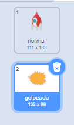
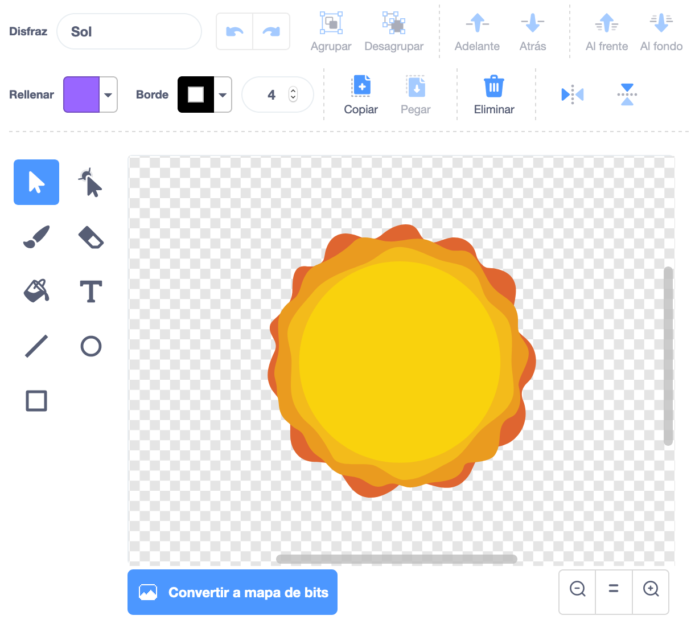

## Explosión de la Nave Espacial

Cuando un hipopótamo toca tu nave espacial, ¡la nave espacial debe explotar!

--- task ---

Selecciona el objeto `nave espacial` y renombra su disfraz "normal".

--- /task ---

--- task ---

Dibuja otro disfraz de una nave espacial explotando y llama al nuevo disfraz "golpeada".



Si no quieres dibujar la explosión, puedes seleccionar el disfraz del 'Sol' de la biblioteca de Scratch y luego usar la herramienta **colorear una forma** para cambiar el color y la cara del disfraz.



--- /task ---

--- task ---

Añade código a tu objeto de la `nave espacial` para que muestre el disfraz "normal" cuando comience el juego y cambie al disfraz "golpeada" cuando la toque un hipopótamo:


```blocks3
when flag clicked
switch costume to (normal v)
wait until <touching (Hippo1 v)>?
switch costume to (golpeada v)
```

--- /task ---

--- task ---

Prueba tu código. Haz que la nave espacial choque con un hipopótamo. ¿Cambia la nave espacial al disfraz 'golpeada'?

--- /task ---