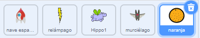

## Murciélago espacial

Para hacer tu juego un poco más difícil, vas a crear un murciélago que arroje naranjas a la nave espacial.


\--- task \---

Añade un objeto `murciélago` y establece su estilo de rotación en **izquierda-derecha**.

\--- /task \---

\--- task \---

Haz que el objeto `murciélago` se `mueva`{:class="block3motion"} de izquierda a derecha en la parte superior del escenario `por siempre`{:class="block3control"}.


```blocks3
when flag clicked
set size to (50) %
forever
    move (10) steps
    if on edge, bounce
end
```

Recuerda probar tu código.

\--- /task \---

Si miras los disfraces del murciélago, puedes ver que tienen cuatro diferentes:


\--- task \---

Usa el bloque `siguiente disfraz`{:class="block3looks"} para hacer que el murciélago bata sus alas mientras se mueve.

\--- hints \---

\--- hint \---

Después de que el murciélago se haya movido, deberías mostrar el `siguiente disfraz`{:class="block3looks"} y luego `esperar`{:class="block3control"} por poco tiempo.

\--- /hint \---

\--- hint \---

Tienes que añadir estos bloques a tu código:

```blocks3
wait (0.3) seconds

next costume
```

\--- /hint \---

\--- hint \---

Tu código debe parecerse a esto:

```blocks3
when flag clicked
set size to (50) %
forever
move (10) steps
if on edge, bounce

+ next costume
+ wait (0.3) seconds
end
```

\--- /hint \---

\--- /hints \---

\--- /task \---

¡Ahora haz que el murciélago lance naranjas!

\--- task \---

Añade el objeto `naranja` de la biblioteca de Scratch.



\--- /task \---

\--- task \---

Añade código a tu murciélago para que `cuando se haga clic en la bandera`{:class="block3events"}, el objeto `murciélago` `espere`{:class="block3control"} `por siempre`{:class="block3control"} durante un período de tiempo `aleatorio`{:class="block3operators"} de `5 a 10`{:class="block3operators"} segundos y luego `crea un clon`{:class="block3control"} del objeto `naranja`.


```blocks3
when flag clicked
forever
    wait (pick random (5) to (10)) secs
    create clone of (Orange v)
end
```

\--- /task \---

\--- task \---

Añade código a la `naranja` para hacer que cada uno de sus clones caiga desde el objeto `murciélago` y cayendo hacia abajo en el escenario.


```blocks3
    when flag clicked
    hide

    when I start as a clone
    go to (Bat v)
    show
    repeat until <touching (edge v)?
        change y by (-4)
    end
    delete this clone
```

\--- /task \---

\--- task \---

Añade algo más de código al objeto `naranja` para que cuando un clon de la `naranja` golpee el objeto `nave espacial`, el clon también desaparezca para dar al jugador la oportunidad de reiniciar:


```blocks3
    when I receive [hit v]
    delete this clone
```

\--- /task \---

\--- task \---

Modifica el código de tu objeto `nave espacial` para que el objeto sea "golpeado" cuando toque un objeto `hipopótamo` o un objeto `naranja`:


```blocks3
    wait until < <touching (Hippo1 v)?> or <touching (Orange v)?>>
```

\--- /task \---

\--- task \---

Prueba tu juego. ¿Qué pasa si una naranja que cae golpea a la nave espacial?

\--- /task \---