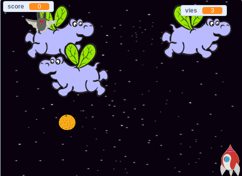

\--- no-print \---

Ceci est la version **Scratch 3** du projet. Il y a aussi une version [Scratch 2 du projet](https://projects.raspberrypi.org/en/projects/clone-wars-scratch2).

\--- /no-print \---

## Introduction

Dans ce projet, tu apprendras à créer un jeu dans lequel tu devras sauver la Terre des aliens.

### Ce que tu feras

\--- no-print \---

Clique sur le drapeau vert dans le jeu de l'exemple ci-dessous pour démarrer, puis appuie sur les touches fléchées <kbd>gauche</kbd> et <kbd>droite</kbd> pour déplacer le vaisseau spatial et <kbd>la touche espace</kbd> pour tirer.

  <iframe allowtransparency="true" width="485" height="402" src="https://scratch.mit.edu/projects/embed/276887163/?autostart=false" frameborder="0" scrolling="no"></iframe>
  

\--- /no-print \---

Marque autant de points que possible en tirant sur des hippopotames volants. Tu perds une vie si tu es frappé par un hippopotame ou par les oranges lâchées par les chauves souris.

\--- print-only \---

\--- /print-only \---

\--- collapse \---

* * *

## title: Ce qu'il faut avoir

### Matériel informatique

+ Un ordinateur capable d'exécuter Scratch 3

### Logiciels

+ Scratch 3 ([en ligne](https://rpf.io/scratchon){:target="_blank"} ou [hors ligne](https://rpf.io/scratchoff){:target="_blank"})

### Téléchargements

[Trouve les téléchargements ici](http://rpf.io/p/en/clone-wars-go).

\--- /collapse \---

\--- collapse \---

* * *

## title: Ce que tu vas apprendre

+ Comment faire bouger les lutins en utilisant les touches du clavier
+ Comment cloner des lutins pour en faire des copies
+ Comment utiliser « diffuser » et « recevoir des blocs » pour envoyer des messages

\--- /collapse \---

\--- collapse \---

* * *

## title: Notes complémentaires pour les éducateurs

\--- no-print \---

Si vous avez besoin d'imprimer ce projet, merci d'utiliser la [version imprimable](https://projects.raspberrypi.org/en/projects/clone-wars/print) {:target="_blank"}.

\--- /no-print \---

Vous pouvez trouver le [ projet terminé ici ](http://rpf.io/p/en/clone-wars-get) .

\--- /collapse \---