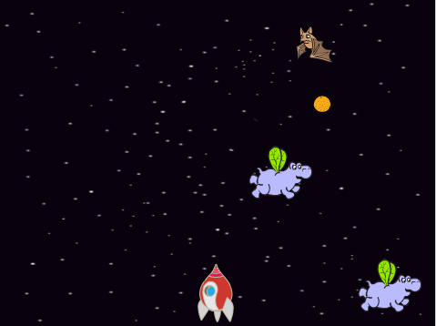

## Introduction

Dans ce projet, vous apprendrez à créer un jeu dans lequel vous devrez sauver la Terre des aliens.

### Qu'allez-vous faire

Cliquez sur le drapeau vert dans le jeu de l'exemple ci-dessous pour démarrer, puis appuyez sur ** à gauche ** et ** droit ** touches fléchées pour déplacer le vaisseau spatial et **la touche espace** à tirer.

Marquez autant de points que possible en tirant sur des hippopotames volants. Vous perdrez une vie si vous êtes frappé par un hippopotame ou par les oranges lâchées par les chauves souris.

  <iframe allowtransparency="true" width="485" height="402" src="https://scratch.mit.edu/projects/embed/46018140/?autostart=false" frameborder="0"></iframe>
  

### Ce que vous apprendrez

Ce projet couvre des éléments des sections suivantes du [Raspberry Pi Digital Making Curriculum](http://rpf.io/curriculum){: target = "_ blank"}:

+ [ Utiliser des constructions de programmation de base pour créer des programmes simples ](https://www.raspberrypi.org/curriculum/programming/creator) {: target = "_ blank"}

### Informations complémentaires pour les responsables de club

Si tu as besoin d'imprimer ce projet, merci d'utiliser la [Version imprimable](https://projects.raspberrypi.org/en/projects/clone-wars/print) {: target = "_ blank"} .

Utilise le lien dans le pied de page pour accéder au dépôt GitHub pour ce projet, qui contient toutes les ressources (y compris un exemple d'un projet terminé) dans le dossier 'en / resources'.