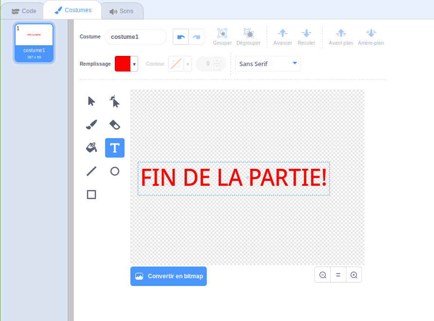

## Game Over

Ensuite, tu va rajouter un message 'game over' à la fin du jeu.

\--- task \---

Si tu ne l'a pas déjà fait, crée une nouvelle variable appelée ` vies `{:class="block3variables"}.

Ton vaisseau spatial devrait commencer avec trois vies et perdre une vie à chaque fois qu’il touche un hippopotame ou une orange. Ton jeu devrait s'arrêter lorsque les ` vies `{:class="block3variables"} sont épuisées.

\--- /task \---

\--- task \---

Dessine un nouveau sprite appelé ` Game Over ` en utilisant le texte ** ** outil.



\--- /task \---

\--- task \---

Sur la scène, diffuser un message ` game over ` {: class = "blockevents"} juste avant la fin de la partie.


```blocks3
diffuser (game over v) et attendre
```

\--- /task \---

\--- task \---

Ajoutez ce code à votre `Game Over` sprite pour qu’il apparaisse à la fin du jeu:


```blocks3
quand le drapeau cliqué
cacher

quand je reçois [game over v]
montrer
```

Comme vous avez utilisé une diffusion `(partie terminée) et attendu`bloc {: class = "block3events"} sur votre scène, la scène attend que l’image-objet `Game Over` s’affiche avant de terminer la partie.

\--- /task \---

\--- task \---

Testez votre jeu. Combien de points pouvez-vous marquer? Si le jeu est trop facile ou trop difficile, pouvez-vous penser à des moyens de l’améliorer?

\--- /task \---