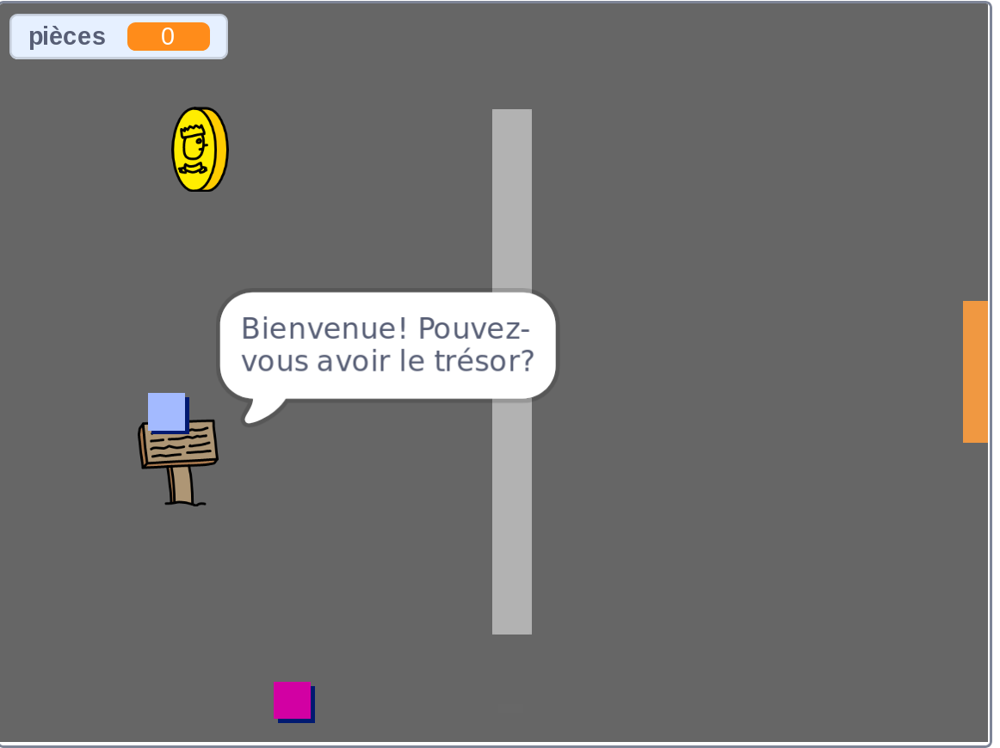

## Et ensuite ?

Essaie notre projet [Crée ton propre monde](https://projects.raspberrypi.org/en/projects/create-your-own-world?utm_source=pathway&utm_medium=whatnext&utm_campaign=projects) dans lequel tu créeras ton propre jeu d'aventure !

\--- no-print \---

Clique sur le drapeau vert pour démarrer. Utilise les touches fléchées pour déplacer ton personnage dans le monde.

  <iframe allowtransparency="true" width="485" height="402" src="https://scratch.mit.edu/projects/embed/258757783/?autostart=false" frameborder="0" scrolling="no"></iframe>
  

\--- /no-print \---

\--- print-only \---

Tu utiliseras les touches fléchées pour déplacer ton personnage dans le monde. 

\--- /print-only \---