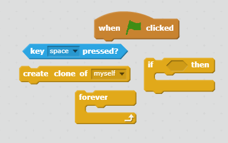

## Foudre

Donnons au vaisseau spatial la capacité de tirer des éclairs!

+ Ajouter le lutin `Lightning `de la bibliothèque Scratch.

+ Lorsque le jeu est lancé, le lutin doit être caché jusqu'à ce que le vaisseau spatial tire avec ses canons laser, ajoutez donc ce code au lutin :

```blocks
Quand le drapeau vert est cliqué
cacher

```

En ce moment, le vaisseau spatial a un joli éclair gigantesque à tirer!

+ Attachez du code sous les blocs que vous venez d'ajouter pour rendre le lutin ` Lightning ` plus petit et le retourner à l'envers. Ensuite, il semblera que l'extrémité pointue part du vaisseau du vaisseau spatial.

```blocks
régler la taille sur (25)% 
pointer vers (-90 v)
```

+ Passez au lutin ` vaisseau spatial ` en cliquant dessus dans le panneau Lutins sous la scène.

+ Ajouter du nouveau code pour faire que le ` vaisseau spatial ` crée un nouvel éclair quand la barre espace est pressée.

\--- astuces \--- \--- indice \--- Voici un code pour vous:

Lorsque le drapeau vert est cliqué, répéter indéfiniment Si la barre **espace** est enfoncée, créez un clone du lutin ` Lightning ` 

 \--- / hint \--- \--- indice \--- Voici le code dont vous aurez besoin:

```blocks
quand le drapeau vert est cliqué
    répéter indéfiniment
    si <key [space v] pressed?> alors
      créer un clone de [lightning v]
    stop 
stop tout 
```

\--- / indice \--- \--- / indices \---

+ Revenez au lutin ` Lightning ` .

+ Chaque fois qu'un éclair est créé, il doit apparaître, puis se déplacer vers le haut jusqu'à ce qu'il atteigne le haut de l'écran. Ensuite, il doit disparaître.

\--- hint \--- \--- /hints \---

Quand un nouveau clone du lutin `Lightning` s’affiche :

+ Afficher :
+ Déplacez-le de manière répétée de ` 10 ` jusqu'à ce qu'il touche le bord de l'écran
+ Puis supprimez le clone\---Conseil\---Voici les blocs dont vous aurez besoin :

 \--- indice \--- Voici le code que vous devrez ajouter au lutin ` Lightning ` :

```blocks
    Quand je commence en tant que clone 
    montrer 
    répéter jusqu'à <touching [edge v] ?>
        changer y par (10)
    stop
    supprimer ce clone
```

\--- / indice \--- \--- / indices \---

+ Testez votre lutin ` Lightning ` en cliquant sur le drapeau vert, puis en appuyant sur la barre **espace** . Lorsque vous appuyez sur ** espace ** , l'éclair apparaît-il et se dirige t'il vers le haut de l'écran? Quel problème pouvez-vous repérer?

## Question

## titre: Réponse

Oups - pour le moment la foudre tire toujours du même endroit, quel que soit l'endroit où se trouve le vaisseau spatial!

Ajoutez ce bloc juste avant le bloc : `montrer` Pour faire que le clone se déplace vers la position du ` vaisseau spatial ` avant qu'il n'apparaisse. Cela donnera l'impression que l'éclair sort du vaisseau spatial.

```blocks
aller à [Spaceship v]
```

\--- /collapse \---

+ Appuyez sur la barre **espace** pour tester si votre éclair se déclenche maintenant correctement.

\--- défi \---

### Défi: réparer l'éclair

Que se passe-t-il si vous maintenez la barre ** espace ** enfoncée ? Pouvez-vous utiliser un bloc {: class = "blockcontrol"} ` attendre ` pour résoudre ce problème?

\--- /défi \---