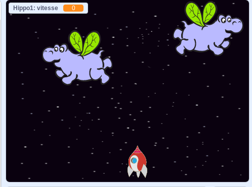

## Hippopotames spatial volant

Ajoutons beaucoup d'hippopotames volants qui essaieront de détruire votre vaisseau spatial.

+ Créez un nouveau lutin avec l'image ` Hippo1 ` de la bibliothèque Scratch. Utilisez l'outil **rétrécir** pour faire que le lutin ` Hippo ` ait une taille similaire au lutin ` Spaceship `.


+ Définir le style de rotation de `l’hippopotame` dans le sens horaire seulement.

[[[generic-scratch-sprite-rotation-style]]]

+ Ajoutez du code pour cacher le lutin `Hippo` quand le jeu commence.

\--- hints \--- \--- hint \--- Le code pour ceci est exactement le même que le code que vous avez utilisé pour cacher le ` lutin eclair ` lorsque le jeu commence \--- / hint \--- \--- hint \--- Voici le code dont vous aurez besoin:

```blocks
Quand le drapeau vert est cliqué
cacher

```

\--- /hint \--- \--- /hints \---

+ Passez à la scène en cliquant dessus dans le panneau inférieur.

+ Ajoutez du code à la scène pour créer un nouvel hippopotame toutes les secondes.

\--- hints \--- \--- hint \--- Quand le drapeau vert est cliqué : Répéter 

+ Attendez entre 2 et 4 secondes
+ Créer un clone du lutin hippopotame

\--- / hint \--- \--- hint \--- Voici le code dont vous aurez besoin:

\--- / hint \--- \--- indice \--- Voici le code dont vous aurez besoin:

```blocks
Quand le drapeau vert est cliqué
répéter indéfiniment
   attendre (choisir aléatoirement entre (2) et (4)) secondes
   créer un clone de [Hippo1 v]
terminer

```

\--- /hint \--- \--- /hints \---

+ Revenez au lutin ` Hippo ` .

Chaque nouvel hippopotame doit apparaître à une position x aléatoire et chacun doit avoir une vitesse aléatoire.

+ Créer une nouvelle variable appelée ` vitesse ` {: class = "blockdata"} pour le lutin ` hippo` uniquement.

[[[generic-scratch-add-variable]]]

Vous saurez que vous avez fait cela correctement lorsque vous pouvez voir que la variable porte le nom du lutin à côté de lui, comme ceci :


+ Au démarrage de chaque clone de hippo, choisissez une vitesse aléatoire et le lieu de départ avant de le montrer sur l’écran.

```blocks
quand je commence comme un ensemble de
clone [vitesse v] (choisir au hasard 2 à 4)
aller à x: (sélection aléatoirement entre -(220) et (220)) y: (150)
montrer
```

+ Testez votre code en cliquant sur le drapeau vert. Un nouvel hippopotame apparaît-il toutes les quelques secondes? Pour le moment vos hippopotames ne bougeront pas.

+ L’hippopotame devrait se déplacer au hasard jusqu'à ce qu’il se fasse frapper par un éclair. Pour ce faire, fixez ce code sous les blocs que vous venez d’ajouter :

```blocks
repeat until <touching [lightning v] ?>
    move (speed) steps
    turn right (pick random (-10) to (10)) degrees
    if on edge, bounce
end
delete this clone
```

+ Testez le code de votre hippo. Vous devriez voir un nouveau clone apparaître toutes les secondes, chacun se déplaçant à sa propre vitesse.
    
    

+ Testez votre canon laser. Si vous frappez un hippopotame, disparaît il?