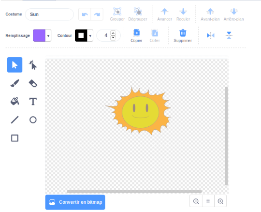

## Explosion du vaisseau spatial

Quand un hippopotame touche ton vaisseau spatial, le vaisseau spatial devrait exploser !

\--- task \---

Sélectionne le sprite `Spaceship` et renomme son costume 'normal'.

\--- /task \---

\--- task \---

Dessine un autre costume de vaisseau spatial en explosion et appelle le nouveau costume «hit».


Si vous ne voulez pas dessiner l'explosion, vous pouvez sélectionner le costume 'Soleil' dans la bibliothèque Scratch, puis utiliser l'outil **Couleur** forme </strong> pour changer la couleur et le visage du costume.



\--- /task \---

\--- task \---

Ajoute du code à ton sprite `Spaceship` pour qu'il affiche le costume "normal" au début du jeu et qu'il passe au costume "hit" lorsqu'il touche un hippopotame:


```blocks3
lorsque le drapeau a cliqué sur
passez de costume à (normal v)
attendez jusqu'à <touching (Hippo1 v)>?
costume de commutation à (hit v)
```

\--- /task \---

\--- task \---

Teste ton code. Fais en sorte que le vaisseau spatial entre en collision avec un hippopotame. Est-ce que le vaisseau spatial change en costume de hit?

\--- /task \---