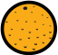

## Chauve-souris de l'espace

Pour rendre ton jeu un peu plus difficile, tu vas créer une chauve-souris qui jette des oranges sur le vaisseau spatial.


\--- task \---

Ajoute un sprite `Bat` et définis son style de rotation sur **gauche-droite**.

\--- /task \---

\--- task \---

Fais `bouger`{:class="block3motion"} le sprite`Bat` de gauche à droite en haut de la scène `indéfiniment`{:class="block3control"}.


```blocks3
quand le drapeau est cliqué
mettre la taille à (50) % de la taille initiale
répéter indéfiniment
    avancer de (10) pas
    rebondir si le bord est atteint
fin
```

N'oublie pas de tester ton code.

\--- /task \---

Si tu regardes les costumes de la chauve-souris, tu peux voir qu'il en a quatre différents :


\--- task \---

Utilise le bloc `costume suivant`{:class="block3looks"} pour faire battre les ailes de la chauve-souris lorsqu'elle bouge.

\--- hints \---

\--- hint \---

Une fois que la chauve-souris a été déplacée, le `costume suivant` devrait apparaître {:class="block3looks"}, et ensuite `attendre`{:class="block3control"} pendant un court instant.

\--- /hint \---

\--- hint \---

Tu dois ajouter ces blocs à ton code:

```blocks3
attendre (0.3) secondes

costume suivant
```

\--- /hint \---

\--- hint \---

You code should look like this:

```blocks3
quand le drapeau est cliqué
mettre la taille à (50) % de la taille initiale
répéter indéfiniment
avancer de (10) pas
rebondir si le bord est atteint

+ costume suivant
+ attendre (0.3) secondes
fin
```

\--- /hint \---

\--- /hints \---

\--- /task \---

Now make the bat throw oranges!

\--- task \---

Add an `Orange` sprite from the Scratch library.


\--- /task \---

\--- task \---

Add code to your bat so that `when the flag is clicked`{:class="block3events"}, the `Bat` sprite `forever`{:class="block3control"} `waits`{:class="block3control"} for a `random`{:class="block3operators"} length of time between `5 to 10`{:class="block3operators"} seconds and then `creates a clone`{:class="block3control"} of the `Orange` sprite.


```blocks3
quand le drapeau est cliqué
répéter indéfiniment
   attendre (nombre aléatoire entre (5) et (10)) secondes
   créer un clone de (Orange v)
fin
```

\--- /task \---

\--- task \---

Add code to the `Orange` to make each of its clone drop, starting from the `Bat` sprite and falling towards the bottom of the Stage.



```blocks3
    quand le drapeau est cliqué
    cacher

    quand je commence comme un clone
    aller à (Bat v)
    montrer
    répéter jusqu'à ce que <toucher (bord v)?
        ajouter (-4) à y
    fin
    supprimer ce clone
```

\--- /task \---

\--- task \---

Add some more code to the `Orange` sprite so that when an `Orange` clone hits the `Spaceship` sprite, the clone also disappears to give the player a chance to reset:


```blocks3
    quand je reçois [hit v]
    supprimer ce clone
```

\--- /task \---

\--- task \---

Modify the code of your `Spaceship` sprite so that the sprite is "hit" when it touches a `Hippo` sprite or an `Orange` sprite:


```blocks3
    attendre jusqu'à ce que < <touching (Hippo1 v)?> ou <touching (Orange v)?>>
```

\--- /task \---

\--- task \---

Test your game. What happens if the spaceship gets hit by a falling orange?

\--- /task \---