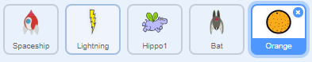

## अंतरिक्ष के चमगादड़

अपने खेल को थोड़ा कठिन बनाने के लिए, आप एक चमगादड़ बनाने जा रहे हैं जो अंतरिक्ष यान पर संतरे फेंकता है।


--- task ---

एक `Bat` स्प्राइट जोड़ें और उसकी रोटेशन शैली को **left–right** सेट करें ।

--- /task ---

--- task ---

`Bat` स्प्राइट को स्टेज के ऊपरी छोर से `हमेशा`{:class="block3control"} बांयी से दांयी ओर `स्थानांतरित`{:class="block3motion"} करवायें ।


```blocks3
when flag clicked
set size to (50) %
forever
    move (10) steps
    if on edge, bounce
end
```

अपने कोड का परीक्षण करना याद रखें।

--- /task ---

यदि आप चमगादड़ की पोशाक की ओर देखें, तो आप देखेंगे कि वे चार अलग-अलग हैं:


--- task ---

चमगादड़ को उड़ते समय पंख हिलाते हुए प्रदर्शित करने के लिए `next costume`{:class="block3looks"} ब्लॉक का प्रयोग करें ।

--- hints ---


--- hint ---

जब चमगादड़ स्थानांतरित होता है तब उसे `next costume`{:class="block3looks"} प्रदर्शित करना चाहिए और फिर उसे थोड़े समय के लिए `प्रतीक्षा`{:class="block3control"}  करनी चाहिए ।

--- /hint ---

--- hint ---

आपको अपनी कोड में ये ब्लॉक्स जोड़ने होंगे:

```blocks3
wait (0.3) seconds

next costume
```

--- /hint ---

--- hint ---

आपका कोड इस प्रकार दिखना चाहिए:

```blocks3
when flag clicked
set size to (50) %
forever
move (10) steps
if on edge, bounce
+ next costume
+ wait (0.3) seconds
end
```

--- /hint ---

--- /hints ---

--- /task ---

अब चमगादड़ से संतरे फिंकवायें ।

--- task ---

स्क्रैच लाइब्रेरी से `Orange` स्प्राइट को जोडें ।



--- /task ---

--- task ---

अपने चमगादड़ में कोड जोड़ते हैं जिससे कि जब `झंडी पर क्लिक`{:class="block3events"} किया जाता है, `Bat` स्प्राइट `हमेशा`{:class="block3control"} `5 से 10`{:class="block3operators"} सेकण्ड्स के बीच `यादृच्छिक`{:class="block3operators"} समय के लिए `इंतज़ार`{:class="block3control"} करता है और फिर वह `Orange` स्प्राइट का `क्लोन`{:class="block3control"} बनाता है ।


```blocks3
when flag clicked
forever
    wait (pick random (5) to (10)) secs
    create clone of (Orange v)
end
```

--- /task ---

--- task ---

संतरे के प्रत्येक क्लोन को `Bat` स्प्राइट से शुरू होकर स्टेज के तल तक गिराने के लिए `Orange` में कोड जोड़ते हैं ।


```blocks3
    when flag clicked
    hide

    when I start as a clone
    go to (Bat v)
    show
    repeat until <touching (edge v)?
        change y by (-4)
    end
    delete this clone
```

--- /task ---

--- task ---

`Orange` स्प्राइट में थोड़ा और कोड जोड़ते हैं जिससे कि जब एक `Orange` क्लोन `Spaceship` स्प्राइट से टकराता है, तब क्लोन गायब हो जाता है और खिलाडी को पुनः आरंभिक स्थिति में आ जाने का अवसर देता है ।


```blocks3
    when I receive [hit v]
    delete this clone
```

--- /task ---

--- task ---

अपने `Spaceship` के कोड में संशोधन करते हैं जिससे कि स्प्राइट एक `Hippo` स्प्राइट या एक `Orange` स्प्राइट को छूने पर "hit" हो जाता है ।


```blocks3
    wait until < <touching (Hippo1 v)?> or <touching (Orange v)?>>
```

--- /task ---

--- task ---

अपने खेल का परीक्षण करें। यदि अंतरिक्ष यान गिरने वाले संतरे से टकरा जाए तो क्या होता है?

--- /task ---