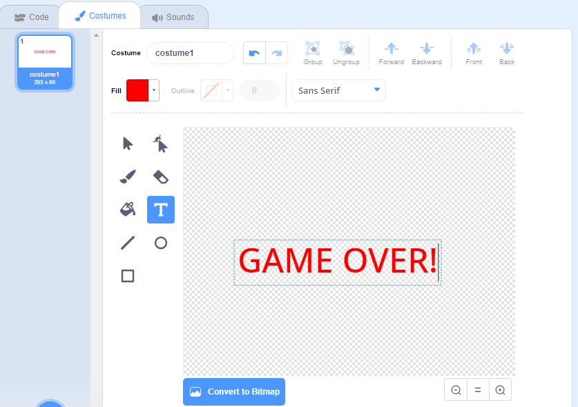

## Kraj igre

Sada ćete dodati poruku 'kraj igre' kada igra završi.

\--- task \---

Ako već niste, stvorite novu varijablu koja se zove `životi` {: Class = "block3variables"}.

Vaš svemirski brod trebao bi započeti s tri života i izgubiti život kad god dodirne nilskog konja ili naranču. Vaša bi se igra trebala zaustaviti kad ponestane `životi` {: class = "block3variables"}.

\--- /task \---

\--- task \---

Nacrtajte novi lik pod nazivom `Kraj igre` koristeći ** tekst ** alat.



\--- /task \---

\--- task \---

Na pozornici prikažite `Kraj igre` {: class = "block3events"} poruku neposredno prije nego igra završi.


```blocks3
pošalji (kraj igre v) i čekaj
```

\--- /task \---

\--- task \---

Dodajte ovaj kôd vašem `Kraj igre` liku kako bi se na kraju igre prikazao:


```blocks3
kada je kliknuta zelena zastava
sakrij

kada primim [kraj igre v]
prikaži
```

Budući da ste koristili `pošalji (igra je gotova) i čekaj` {: class = "block3events"} blok na vašoj pozornici, pozornica će čekati da se prikaže lik `Kraj igre` prije završetka igre.

\--- /task \---

\--- task \---

Testirajte svoju igru. Koliko bodova možete postići? Ako je igra previše lagana ili previše naporna, možete li smisliti načine kako je poboljšati?

\--- /task \---