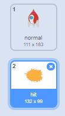
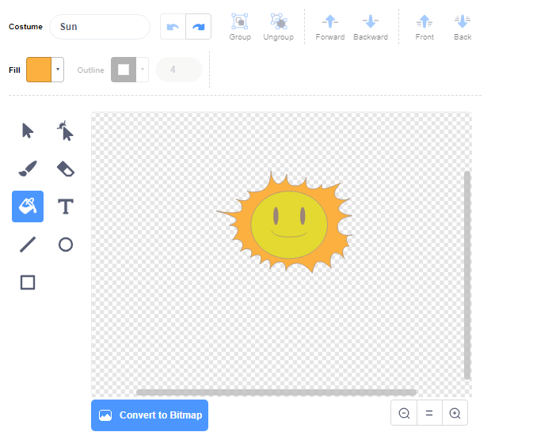

## Eksplozija svemirskog broda

Kada nilski konj dotakne vaš svemirski brod, on bi trebao eksplodirati!

\--- task \---

Odaberite lik `Svemirski brod` i promijenite naziv njegovog kostima u 'normalan'.

\--- /task \---

\--- task \---

Nacrtajte još jedan kostim svemirskog broda koji eksplodira i nazovite novi kostim 'pogodak'.



Ako ne želite nacrtati eksploziju, možete odabrati "Sunce" kostim iz Scratch knjižnice i zatim upotrijebite **Oboji oblik** alat za promjenu boje i lica kostima.



\--- /task \---

\--- task \---

Add some code to your `Spaceship` sprite so that it displays the 'normal' costume when the game starts, and switches to the 'hit' costume when it touches a hippo:


```blocks3
when flag clicked
switch costume to (normal v)
wait until <touching (Hippo1 v)>?
switch costume to (hit v)
```

\--- /task \---

\--- task \---

Test your code. Make the spaceship collide with a hippo. Does the spaceship change to the 'hit' costume?

\--- /task \---