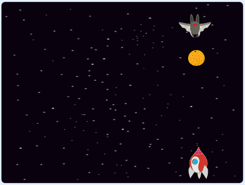

## Svemirski šišmiši

Da biste malo otežali svoju igru, napraviti ćete šišmiša koji baca naranče na svemirski brod.



\--- task \---

Dodajte lik `Šišmiš` i postavite njegov stil rotacije na **lijevo-desno**.

\--- /task \---

\--- task \---

Make the `Bat` sprite `move`{:class="block3motion"} from left to right at the top of the Stage `forever`{:class="block3control"}.


```blocks3
kada je kliknuta zelena zastava
postavi veličinu na (50) %
ponavljaj
    idi (10) koraka
    ako si na rubu, okreni se
kraj
```

Ne zaboravite testirati svoj kôd.

\--- /task \---

Ako pogledate kostime šišmiša, možete vidjeti da ima četiri različita:


\--- task \---

Use the `next costume`{:class="block3looks"} block to make the bat flap its wings as it moves.

\--- pomoć \---

\--- hint \---

After the bat has moved, it should show the `next costume`{:class="block3looks"} and then `wait`{:class="block3control"} for a short time.

\--- /pomoć \---

\--- hint \---

Ove blokove morate dodati u kod:

```blocks3
čekaj (0.3) sekundi
slijedeći kostim
```

\--- /pomoć \---

\--- hint \--- Vaš kôd treba izgledati ovako:

```blocks3
kada je kliknuta zelena zastava
postavi veličinu na (50) %
ponavljaj
idi (10) koraka
ako si na rubu, okreni se

+ slijedeći kostim
+ čekaj (0.3) sekundi
kraj
```

\--- /pomoć \---

\--- /pomoć \---

\--- /task \---

Napravite da šišmiš baca naranče!

\--- task \---

Dodajte lik `Naranča` iz Scratch knjižnice.


\--- /task \---

\--- task \---

Add code to your bat so that `when the flag is clicked`{:class="block3events"}, the `Bat` sprite `forever`{:class="block3control"} `waits`{:class="block3control"} for a `random`{:class="block3operators"} length of time between `5 to 10`{:class="block3operators"} seconds and then `creates a clone`{:class="block3control"} of the `Orange` sprite.


```blocks3
kada je kliknuta zelena zastava
ponavljaj
    čekaj (slučajan broj od (5) do (10)) sekundi
    kloniraj (Naranča v)
kraj
```

\--- /task \---

\--- task \---

Dodaj naredbe liku `Naranča` kako bi svaki njegov klon ispustio, počevši od lika `Šišmiš` i padajući prema dnu pozornice.


```blocks3
    kada je kliknuta zelena zastava
    sakrij

    kada krećem kao klon
    idi do (Šišmiš v)
    prikaži
    ponavljaj dok nije <dodiruje (rub v)>
        promijeni y za (-4)
    kraj
    izbriši klona
```

\--- /task \---

\--- task \---

Dodajte još naredbi liku `Naranča` tako da kad njegov klon pogodi lik `Svemirski brod`, klon također nestane kako bi igrač ponovno započeo igru:


```blocks3
    kada primim [pogodak v]
    izbriši klona
```

\--- /task \---

\--- task \---

Izmijenite kôd lika `Svemirskog brod` tako da je "pogođen" kada dodirne lik ` Nilski konj` ili lik `Naranča`:


```blocks3
    čekaj do <(dodiruje (Nilski konj1 v)) ili (dodiruje (Naranča v))>
```

\--- /task \---

\--- task \---

Testirajte svoju igru. Što se događa ako svemirski brod pogodi padajuću naranču?

\--- /task \---